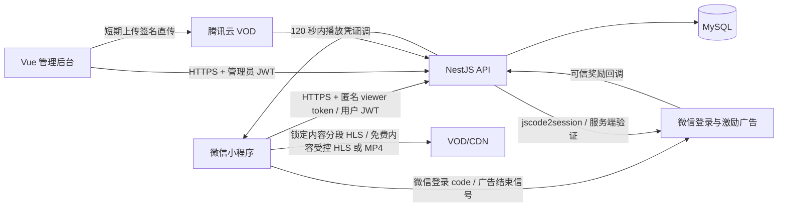

# 系统架构与业务不变量

- 文档用途：定义稳定系统边界、信任模型、数据一致性和故障策略
- 更新日期：2026-08-19
- 本文描述目标架构和必须保持的业务不变量，不代表所有模型与机制已经实现；当前状态统一见 [status.md](./status.md)

本系统采用 **NestJS 模块化单体 API + MySQL + Vue 管理端 + uni-app 微信观看端**。在业务规模和团队边界没有证据支持前，不拆分微服务；模块之间通过显式服务接口和数据库事务协作，不直接复制彼此的业务规则。

## 1. 请求、回调与媒体流

服务端是目录可见性、内容发布、奖励发放、权益余额和播放许可的唯一事实来源。小程序不能直接修改余额，也不能使用长期媒体地址。

页面、接口、认证和错误契约见 [pages-and-apis.md](./pages-and-apis.md)；运行组件、数据库与托管拓扑见 [deployment.md](./deployment.md)；环境和秘密配置见 [configuration.md](./configuration.md)；后台日常操作见 [admin-handbook.md](./admin-handbook.md)；事故操作见 [operations.md](./operations.md)；管理员无法登录时的公开恢复见 [admin-emergency-access.md](./admin-emergency-access.md)。

## 2. 模块边界

- `auth`：匿名 viewer 会话、微信 code 换用户会话；管理员独立登录、强认证和角色检查。
- `catalog`：只公开 `PUBLISHED` 且权利有效的剧目。
- `content`：剧目、剧集、媒体版本、权利资料、审核和发布状态机。
- `rewards`：一次性挑战、可信回调、幂等奖励；客户端完成证明仅限非生产内部技术验证，外部灰度与生产不得据此发奖。
- `entitlements`：不可变发放、消费与纠错事实、FEFO 结算和人工补偿与调整。
- `playback`：单活租约、短凭证、心跳结算和观看进度。
- `integrations`：微信和腾讯云 VOD provider；Mock 与 Live 实现不能混用。
- `callbacks`：VOD 与奖励回调的验签、事件幂等、重试占用、死信与重放。
- `operations`：合规闸门、熔断、审计、健康检查、指标事件和恢复控制。
- `privacy`：注销申请、可删除数据清理、法定保留记录隔离和处理结果查询。
- `social`：关注、剧评、用户主页墙、评论赞、私信（须先关注）、收藏与喜欢剧；不进入当前播放主路径。存储约定见 [social-library-model.md](./social-library-model.md)。

模块可以共享 `packages/contracts` 中的稳定类型、枚举和常量，但不得绕过所属模块直接推进业务状态。

## 3. 身份、权限与信任边界

### 3.1 观看端身份

- **匿名 viewer token**：短期、设备/会话绑定，只能申请和维护免费集租约；不能访问锁定集、奖励、权益、历史或服务端进度。
- **用户 JWT**：由用户显式触发微信登录后签发，可访问本人权益、历史、进度、奖励和锁定内容租约。
- 匿名观看进度只保存在本地；登录后按有效更新时间与服务端进度合并，服务端拒绝未发布剧目或无效媒体位置。
- 微信 `session_key` 只存在于服务端受控边界，不返回客户端、不进入日志。

### 3.2 管理端身份

- EDITOR 可创建剧目、修改本人负责且处于可编辑状态的剧目、审核待审内容（含自己提交的版本）、发布和下架。不能访问运营控制、全局审计和账号管理。
- 存量 REVIEWER 与 EDITOR 权限相同；新建账号不再提供该角色。
- ADMIN 具备 EDITOR 的全部内容能力，并可修改任意剧目；同时执行熔断、补偿、审计和账号管理。不能绕过权利、媒体审核或发布闸门。
- 前端路由、导航和按钮不是安全边界；所有角色、所有权和状态限制必须在服务端执行。

### 3.3 外部信任边界

- 微信、VOD 和 CDN 均视为外部系统；所有回调必须验签、校验事件 ID，并设置超时、限频和重放保护。
- 客户端上报的广告结束、媒体位置、播放状态、设备 ID 和时间戳都不天然可信，只能作为服务端校验输入。
- 服务端时间是挑战过期、权益过期、凭证 TTL 和审计时间的权威时钟。

## 4. 核心数据与事实来源

当前可执行数据模型见 [`apps/api/prisma/schema.prisma`](../apps/api/prisma/schema.prisma)。下表同时包含目标模型；尚未进入 Prisma schema 的记录以 [status.md](./status.md) 实现矩阵为准。

| 领域 | 核心记录 | 不变量 |
| --- | --- | --- |
| 内容 | Drama、Episode、RightsRecord、MediaAsset、Review | 稳定集号不复用；权利和媒体使用版本记录；已发布内容不可原地修改 |
| 身份 | User、匿名/用户会话、Admin | 用户、匿名 viewer 和管理员令牌不可互换 |
| 奖励 | RewardChallenge、provider callback event | challenge 一次性；可信验证与幂等约束决定是否发奖 |
| 权益 | EntitlementGrant、EntitlementDebit/Consumption、EntitlementAdjustment | 发放、消费和纠错事实不可修改；余额可重建且不为负 |
| 播放 | PlaybackLease、PlaybackReservation、Heartbeat、WatchProgress | 锁定内容单活租约；媒体窗口受服务端预算约束；心跳顺序唯一 |
| 社交与片库 | UserFollow、Comment（`DRAMA`/`USER`）、CommentLike、DirectConversation、DirectMessage、DramaFavorite、DramaLike、WatchEpisodeProgress | 列表不进 User 行；计数可重建；墙与剧评同表；私信须先关注；整剧看完由每集完成态派生。详见 [social-library-model.md](./social-library-model.md) |
| 运营 | CircuitBreaker、AuditLog、OperationalEvent、SystemNotification、UserFeedback | 熔断和管理动作必须记录原因、操作者、时间和对象；系统通知是可撤回的公共内容，反馈和管理员回复是用户服务事实；用户反馈创建使用 OperationalEvent 记录用户主体，管理员处理使用追加式 AuditLog，不把完整正文写入审计 |

## 5. 事务、并发与幂等

- 奖励完成在事务内锁定 challenge；同一 challenge 只能关联一个 grant，`Idempotency-Key` 重试返回同一结果。
- Provider 回调以事件 ID 去重；处理中事件使用有限租约，进程失败后允许安全重试。
- 同一用户只能存在一个锁定内容活动租约；创建新租约在同一一致性边界内撤销旧租约。
- 心跳以 `(leaseId, seq)` 唯一，重复请求返回既有结果，乱序请求不产生消费。
- 权益消费在事务内按 FEFO 选择批次，使用条件更新防止并发超扣；所有 debit/consumption 与心跳可关联。
- 人工补偿必须幂等并写入审计，不能覆盖原奖励或修改历史消费。
- 负向纠错不修改原 grant 或 debit，而是追加引用原事实的 adjustment；冻结、释放冻结和核销分别使用明确类型，纠正性发放仍使用新的补偿 grant。adjustment 与并发 debit、reservation 在同一事务和锁定顺序内执行。
- Adjustment 使用 `Idempotency-Key` 和原事实引用去重；释放冻结必须引用唯一冻结记录，累计释放量不得超过该记录尚未释放的秒数。
- 任何跨网络调用都不能与数据库事务假设为原子；先持久化可恢复状态，再调用 provider 或处理可重试回调。

## 6. 权益与播放不变量

1. 一次挑战最多产生一笔 600 秒奖励；挑战 ID、nonce、幂等键和平台交易号都参与去重。
2. grant 的来源、初始秒数、剧目和过期时间不可修改；广告奖励默认 `expiresAt = grantedAt + 24h`。
3. 消费只选择未过期且 `remainingSeconds > 0` 的当前剧批次，按最早到期优先。
4. 消费事实追加保存；`remainingSeconds` 可以作为事务内维护的物化余额，但必须能由 grant 和消费事实对账重建。
5. 数据库事务和条件更新保证 `remainingSeconds >= 0`；冲突时整个结算重试或失败，不部分扣减。
6. 免费集从不创建权益扣减记录，但仍必须使用服务端签发的短期匿名播放租约和媒体凭证。
7. 客户端心跳和媒体位置不作为唯一计费证据；锁定内容必须使用租约绑定的分段媒体、密钥授权或等价的服务端可观测短窗口，不能用一条 120 秒外层凭证暴露整集可连续下载地址。
8. 服务端在签发下一播放窗口前按 FEFO 预留最多一个小结算周期的权益。预留降低可再次分配余额，但不是消费事实；只有服务端媒体授权/交付证据与合理递增心跳共同确认后才转为 debit。
9. 暂停、缓冲、后台或服务端确认未交付的窗口在到期后释放预留，不产生 debit。已交付但缺少心跳的窗口不得自动扣费，也不得继续签发新窗口，进入可恢复的未确认暴露状态。
10. 未确认暴露按用户、设备和租约累计并设置硬上限；存在未释放预留或超过上限时禁止创建新锁定租约，防止反复建租约绕过扣费。网络恢复后通过同一租约重放心跳或受控核验解除。
11. 心跳只接受活动租约和严格递增的 `seq`；重复或乱序请求不重复扣减。
12. 只有 `playing`、媒体进度合理正向变化且对应服务端媒体窗口已授权/交付时才消费；跳播产生的非连续增量消费为零。
13. 用户同一时刻只有一个活动的锁定内容租约；创建新租约会撤销旧租约，但不能清除原租约的预留或未确认暴露。
14. 默认每 5 秒上报心跳；断网或无有效心跳超过 15 秒后，锁定内容暂停并进入恢复流程。
15. 剧目下架、权利过期、全局或剧目熔断后，不签发或续签播放凭证。
16. 外层播放凭证最长 120 秒；其有效期不等于可播放预算。紧急停播先停止新窗口，既有窗口在已验证的最大窗口内失效，必要时使用 CDN 清理、密钥轮换或活动会话撤销加速。

### 6.1 权益纠错

- 错误发放但尚未消费时，追加 `FREEZE_REMAINDER` adjustment 冻结可用剩余秒数；确认可恢复时追加 `RELEASE_FREEZE`。
- 需要补足用户权益时追加新的补偿 grant，不修改原 grant。
- 错误发放已经被消费时，不向用户制造负余额或追扣未来权益；追加 `WRITE_OFF`/事故记录完成财务与审计核销。
- 每个 adjustment 必须包含原事实 ID、原因、秒数、审批人、操作者和时间。单笔 grant 的结余 = 初始秒数 - 关联的 debit - 未释放冻结；总账本结余为所有未过期 grant 的结余之和。可分配余额在此基础上再减去所有活动 reservation。`WRITE_OFF` 只影响财务/事故核销，不再次改变用户余额。
- 冻结或释放冻结必须锁定相关 grant、未结 reservation 和物化余额，并与并发消费使用统一锁定顺序；冲突时整体重试，不能出现消费与冻结同时占用同一秒数。

### 6.2 未确认播放恢复

- 客户端可查询本人活动租约、预留、未确认窗口及恢复原因；重新安装后不依赖本地 lease 状态恢复。
- 恢复操作先核对服务端媒体授权/交付记录：确认未交付则释放预留；能补齐合法心跳则按原租约幂等结算。
- 已交付但无法确认播放时不自动扣费。系统可在外层凭证和交付日志稳定后执行一次受审计的宽限释放，同时增加滚动风险计数；同一用户/设备在配置窗口内超过宽限次数后转客服核验，不能无限自动释放。
- 客服恢复只能释放或关闭具体未确认窗口，不得清除风险历史、篡改 debit 或直接增加余额；需要补偿时使用独立幂等补偿 grant。

## 7. 内容、媒体与发布不变量

发布动作必须同时验证：

- 权利资料存在且未过期；
- 发行许可证或上线报备号存在；
- 权利范围包含微信小程序传播、广告变现、转码和宣传物料；
- 每个稳定集号都有一个当前媒体版本；
- 当前媒体版本已转码、机审、人工审核和微信视频发布通过；
- 外部流量合规闸门已通过。

已发布剧集不能改变稳定集号。替换视频会创建新媒体版本并重新经过完整审核。

媒体状态必须按不同维度记录：

- `mediaStatus` 表示上传与文件处理；
- `transcodeStatus` 表示转码结果；
- `machineReviewStatus`、`manualReviewStatus`、`wechatReviewStatus` 分别表示机审、人工审核和微信审核；
- 只有媒体与转码 READY、三个审核维度全部 APPROVED，媒体版本才整体可发布。

权利资料、媒体和审核记录采用版本化追加，不通过覆盖旧记录制造“已审核”状态。剧目下架后重新发布必须重新校验当前权利、当前媒体版本和匹配的审核版本。

## 8. Provider 与回调策略

- Provider 通过接口适配层隔离；业务模块不直接依赖微信或腾讯云 SDK 的返回结构。
- Mock、内部联调和 Live 必须显式选择，禁止在 Live 调用失败后自动回退 Mock。
- 外部灰度与生产奖励只接受可信服务端验证或可信回调；`client_attestation` 仅限经书面批准的非生产内部技术验证。
- 回调验签应覆盖原始请求体、时间窗（协议支持时）、事件 ID 和来源配置；验签失败不改变业务状态。
- 网络超时、5xx 和限频使用有上限的指数退避与随机抖动；业务拒绝、验签失败和无权限不得盲目重试。
- Circuit breaker 打开时返回稳定错误码并停止新业务，不伪造 provider 成功。

回调事件状态为 `RECEIVED → PROCESSING → PROCESSED / RETRYABLE_FAILURE / DEAD_LETTER / REJECTED`：

- 接收端必须先持久化事件、原始载荷哈希，以及重放所需的规范化载荷；敏感载荷需加密、限制访问并按保留期删除。完成持久化后才按 provider 协议返回 ACK；未持久化成功不得确认消费。
- 验签或业务身份无效进入 `REJECTED`，不自动重试；瞬时失败进入 `RETRYABLE_FAILURE`。
- 重试次数或时间窗耗尽后进入 `DEAD_LETTER`，触发告警、对应 provider 熔断和责任人升级。
- 管理员只能通过受审计的重放操作将 `RETRYABLE_FAILURE` 或 `DEAD_LETTER` 原子迁移回 `PROCESSING`；重放沿用原事件 ID 和幂等约束，记录重放批次、操作者与结果，不能复制新业务事实。
- 奖励回调死信时 challenge 在有效期内保持 PENDING 并向用户显示验证延迟。若重放发生在 challenge 过期后，但可信 provider 证明广告在原有效期内完成且事件处于允许的回调延迟窗口，则允许 `EXPIRED → COMPLETED_LATE`，仍只能产生原 challenge 的唯一 grant；不满足条件时只能进入人工补偿流程。
- 媒体回调死信时媒体保持不可发布，不能推测为 READY。

## 9. API、进程与部署约束

- HTTP 成功与错误均携带 `requestId`；稳定路径、类型、错误码和认证约定集中在 `packages/contracts`。
- API 进程保持无本地业务状态，可横向扩展；并发正确性依赖数据库唯一约束、事务和条件更新，而不是单进程内存锁。
- 数据库迁移采用 expand/contract 或其他经批准的向后兼容方式；新旧应用版本必须在发布窗口内兼容。
- 常规回滚只回退应用/配置或执行前滚修复，不能用数据库恢复覆盖发布后新增的权益、审计和业务记录。
- 数据库恢复只用于灾难恢复，并包含恢复点后权益、审计和业务写入的对账与补录。
- 进程必须支持优雅关闭：停止接收新请求、完成或释放正在处理的回调租约、关闭数据库连接，并让未完成工作可重试。
- 健康检查区分存活与就绪；响应不得泄露秘密、连接串或内部配置。

## 10. 安全与隐私约束

- 所有外部输入使用 DTO/schema 校验并限制字符串、数组、分页和上传范围。
- 用户、管理员、provider 回调分别使用独立认证机制；CORS、微信合法域名和管理端 Origin 使用生产白名单。
- 秘密只由部署平台或密钥管理注入，不进入前端变量、Git、构建产物、日志或错误响应。
- 日志、埋点、客服和审计不得保存微信 `session_key`、完整令牌、完整请求体或非必要个人信息。
- 播放、奖励、登录、回调、搜索和管理操作分别限频；限频键不能只依赖可伪造的客户端字段。
- 注销申请在单个事务内生成受限查询令牌摘要、将账户标记为 `DELETION_PENDING`、撤销用户会话与活动租约并阻止新奖励；事务提交后才返回 `deletionRequestId` 和查询令牌。所有鉴权必须检查账户状态，使旧 JWT 在提交后立即失效。
- 若注销响应丢失，不能回滚已生效的撤权；只能通过受控客服身份核验恢复申请查询能力。可删除数据按保留矩阵清理，必须保留的权益、版权、安全和审计记录最小化并隔离直接身份。
- 管理操作、人工补偿、秘密轮换和高风险导出必须可审计；审计记录不可由业务用户修改或删除。

## 11. 可观测性与运维

- 结构化日志至少包含 `requestId`、模块、稳定错误码、耗时和脱敏实体 ID；跨 API、回调、challenge、grant、lease 与 heartbeat 可关联。
- 指标至少覆盖登录、API 错误、数据库、播放启动、心跳失败、广告加载/完成/发放、奖励异常、VOD 回调、投诉和熔断状态。
- 告警必须有负责人、阈值、通知渠道和升级路径，并通过测试事件验证可达。
- 核心账本需周期对账：provider 结果 → challenge → grant → consumption → remaining balance；差异超过冻结阈值时熔断奖励或播放链路。
- 权利到期、回调重试、死信重放、数据清理和其他后台任务必须幂等、可重入、可观察；多实例执行时需要数据库租约或等价的单次执行约束。
- 回调积压、最老未处理年龄、重试次数、死信数量和人工重放结果必须进入指标与告警。

## 12. 失败与恢复策略

- 广告无填充、加载失败或未看完：不发奖励，保留既有权益并允许重试。
- 微信或 VOD 未配置：返回明确 `PROVIDER_NOT_CONFIGURED`，不伪造成功。
- 广告验证结果未知：保留原 challenge 为 PENDING，使用同一幂等键延迟重试，不创建新 challenge。
- VOD 回调重复或乱序：以事件 ID 幂等；回调处理必须可重试，各媒体维度只能按允许的状态迁移推进。
- 回调重试耗尽：事件进入 DEAD_LETTER 并熔断相关 provider；奖励保持待确认至 challenge 过期，媒体保持不可发布，人工重放前不猜测成功。
- 额度耗尽：下一次心跳返回 `mayContinue=false`，播放器立即暂停并保留进度。
- 断网超过 15 秒：锁定内容暂停；恢复后申请或续签租约。
- 下架：立即停止新凭证，既有短凭证在最长 120 秒窗口内失效；审计记录和权益账本保留。
- 数据库或并发冲突：事务整体回滚并返回稳定错误码，禁止部分发奖、部分扣费或重复补偿。
- 发布失败：回退应用/配置或前滚修复；数据库灾难恢复后必须对账和补录。
- 事故恢复：根因确认、修复验证和小流量复开全部通过后才能恢复全量；涉及回调或事件处理时还必须完成脱敏事件重放。

## 13. 明确不采用的架构

- 不为尚未证明的规模拆分微服务、引入跨服务分布式事务或多套权益事实来源。
- 不由客户端决定内容可见性、奖励成功、余额、免费集规则或播放许可。
- 不保存长期签名媒体 URL，不把 VOD/CDN 当作用户授权系统。
- 不通过删除账本、审计、回调或版权记录处理事故和回滚。
- 不让 Demo/Mock、原生过渡小程序或未来多端形成独立业务规则。
