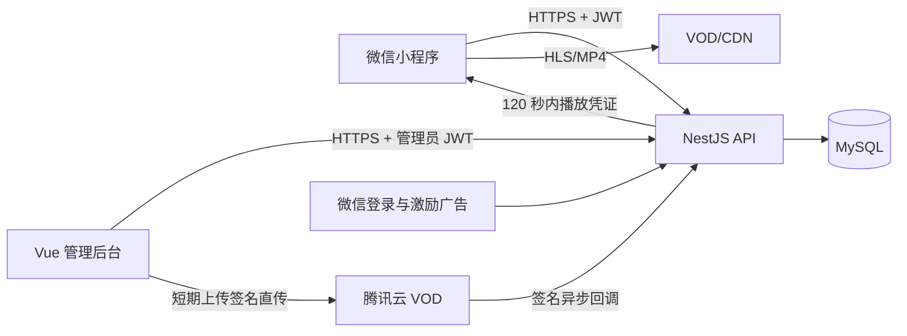

# 系统架构与业务不变量

## 请求和媒体流

服务端是目录可见性、内容发布、奖励发放、权益余额和播放许可的唯一事实来源。小程序不能直接修改余额，也不能使用长期媒体地址。

## 模块边界

- `auth`：微信 code 换服务端会话；管理员独立登录和角色检查。
- `catalog`：只公开 `PUBLISHED` 且权利有效的剧目。
- `content`：剧目、剧集、媒体版本、权利资料、审核和发布状态机。
- `rewards`：一次性挑战、可信回调或客户端完成证明、幂等奖励。
- `entitlements`：不可变发放批次、FEFO 消费和补偿。
- `playback`：单活租约、短凭证、心跳结算和观看进度。
- `integrations`：微信和腾讯云 VOD provider；Mock 与 Live 实现不能混用。
- `operations`：合规闸门、熔断、审计、健康检查和指标事件。

## 权益不变量

1. 一次挑战最多产生一笔 600 秒奖励；挑战 ID、nonce、幂等键和平台交易号都参与去重。
2. 奖励以批次保存，不覆盖汇总余额；每笔 `expiresAt = grantedAt + 24h`。
3. 消费只选择未过期且 `remainingSeconds > 0` 的当前剧批次，按最早到期优先。
4. 数据库事务和条件更新保证 `remainingSeconds >= 0`。
5. 免费集从不创建权益扣减记录。
6. 心跳只接受活动租约和严格递增的 `seq`；重复或乱序请求不重复扣减。
7. 只有 `playing` 且媒体进度正向变化才消费；暂停、缓冲和后台状态消费为零。
8. 用户同一时刻只有一个活动的锁定内容租约；创建新租约会撤销旧租约。
9. 剧目下架、权利过期、全局或剧目熔断后，不签发或续签播放凭证。

## 内容发布不变量

发布动作必须同时验证：

- 权利资料存在且未过期；
- 发行许可证或上线报备号存在；
- 权利范围包含微信小程序传播、广告变现、转码和宣传物料；
- 每个稳定集号都有一个当前媒体版本；
- 当前媒体版本已转码、机审、人工审核和微信视频发布通过；
- 审核人不是创建该版本的编辑；
- 外部流量合规闸门已通过。

已发布剧集不能改变稳定集号。替换视频会创建新媒体版本并重新经过完整审核。

## 失败策略

- 广告无填充、加载失败或未看完：不发奖励，保留既有权益并允许重试。
- 微信或 VOD 未配置：返回明确 `PROVIDER_NOT_CONFIGURED`，不伪造成功。
- VOD 回调重复或乱序：以事件 ID 幂等；回调处理必须可重试，媒体聚合状态只能按显式状态机向前推进。
- 额度耗尽：下一次心跳返回 `mayContinue=false`，播放器立即暂停并保留进度。
- 断网超过 15 秒：锁定内容暂停；恢复后申请或续签租约。
- 下架：停止新凭证，既有短凭证自然失效，审计记录和权益账本保留。
