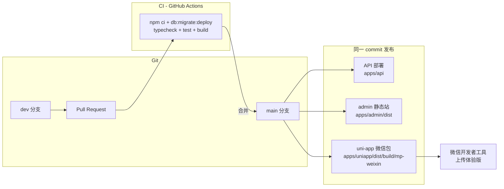

# 最小 CI/CD 与发布流水线

- 文档用途：在**不改为微信云开发/云函数架构**的前提下，给出 Git 托管、CI、API 部署、管理端静态托管与小程序体验版上传的最小操作清单
- 更新日期：2026-08-14
- 适用阶段：内部收口与 Mock 联调完成后的**体验版/灰度前工程准备**；合规闸门与 Live provider 仍以 [release-checklist.md](./release-checklist.md) 为准

## 1. 结论

| 组件 | 最小方案 | 说明 |
| --- | --- | --- |
| Git 托管 | **GitHub（现状）** 或 **腾讯云 Coding** | 作纯 Git 仓，**不绑定微信云开发 Git** |
| CI | **GitHub Actions**（已有） | PR / push `main` 跑 typecheck、测试、构建、MySQL 迁移 |
| API | 腾讯云轻量/CVM + 云数据库 MySQL | 从同一 commit 构建 NestJS，注入生产环境变量 |
| 管理后台 | 对象存储 + CDN 或 Nginx 静态站 | Live 构建写入公开 API 地址 |
| 小程序 | 开发者工具本地上传体验版 | 日流水上来后再加 CI 自动上传 |

本仓库后端是 `apps/api`（NestJS + Prisma + MySQL），**不是** `cloudfunctions/`。微信云开发 Git 的「推送即部署云函数」对当前架构无收益。

## 2. 流水线总览



**硬规则**：API、管理端、小程序必须来自**同一 Git commit**；发布工单记录 commit SHA，禁止「API 是新版本、小程序是旧版本」混发。

## 3. Git 与分支

### 3.1 托管平台

**首选：继续用 GitHub**

- 已有 [`.github/workflows/ci.yml`](../.github/workflows/ci.yml)，与 NestJS + Prisma 测试链路匹配
- 国内 push/clone 慢时，可开 Coding **镜像仓**（Coding 从 GitHub 同步），CI 仍跑在 GitHub；或整体迁到 Coding 并复制同等 workflow

**不推荐**

- 微信云开发 Git（架构不匹配）
- 自建 GitLab（6k 预算运维成本高）

### 3.2 分支策略（小团队）

| 分支 | 用途 | 保护 |
| --- | --- | --- |
| `main` | 可发布候选 | 禁止直接 push；仅 PR 合并 |
| `dev` | 日常开发 | 可 push；合并前 CI 必须通过 |

功能分支可选：`feat/xxx` → PR → `dev` → 稳定后 PR → `main`。

## 4. CI（已有 + 建议）

### 4.1 当前 CI 做什么

触发：`pull_request`、`push` 到 `main`。

步骤（与本地 `npm run check` 等价，并多跑迁移）：

```bash
npm ci
npm run db:generate
npm run db:migrate:deploy    # 对 CI MySQL 服务
npm run typecheck
npm test
npm run build
```

`db:generate` / `db:migrate*` / `db:seed` 在仓库根存在 `.env` 时加载它。CI **不提交** `.env`，此时使用 workflow 注入的 `DATABASE_URL`。不要用 `node --env-file=.env`：文件缺失时 Node 会以退出码 9 失败。

### 4.2 合并前人工检查

- [ ] PR 描述写明影响端（api / admin / uniapp / contracts）
- [ ] 若改 `packages/contracts` 或 Prisma schema，确认前后端已同步
- [ ] CI 全绿后再合并

### 4.3 可选增强（非 MVP 必须）

| 增强项 | 时机 |
| --- | --- |
| `dev` 分支也跑 CI | 团队 > 2 人或 dev 常红时 |
| Live 构建烟测 job | 外部灰度前，用 secrets 注入 `MICROFOCUS_PUBLIC_API_URL` 跑 `build:admin:live` / `build:uniapp:live` |
| 密钥扫描（gitleaks / trufflehog） | 第一次接真实 secret 前 |
| Coding 侧 duplicate workflow | 仅当 Git 主仓迁到 Coding 时 |

## 5. 发布流水线（体验版最小路径）

以下假设目标域名示例为 `api.example.com`、`admin.example.com`；实际以发布工单为准。

### 5.0 发布前统一校验

在**将要发布的 commit** 上执行：

```bash
git checkout <release-commit>
npm ci
npm run check
```

记录：`git rev-parse HEAD` → 写入发布工单。

### 5.1 MySQL（云数据库）

1. 创建腾讯云 CDB MySQL 8.x（或与 CI 同大版本）。
2. 安全组：**仅允许 API 服务器 IP** 访问 3306。
3. 开启自动备份；恢复策略见 [operations.md](./operations.md)。
4. 在 API 服务器或一次性运维任务中，对**空白库**执行：

```bash
DATABASE_URL='mysql://...' npm run db:migrate:deploy
```

5. 按需执行 seed（仅/bootstrap 场景；生产 seed 需单独审批）。

### 5.2 API 部署

**构建**（在 CI 已通过同一 commit 的机器上）：

```bash
npm ci
npm run build -w @microfocus/contracts
npm run build -w @microfocus/api
# 产物：apps/api/dist/
```

**环境变量**（经平台密钥管理注入，勿写入 Git）：

- 必填：`NODE_ENV=production`、`DATABASE_URL`、`JWT_SECRET`、`TOTP_ENCRYPTION_KEY`、`PUBLIC_API_URL`、`ADMIN_ORIGIN`
- Live 闸门：`WECHAT_MODE=live`、`VOD_MODE=live`、四项 `COMPLIANCE_*=true`（见 [configuration.md](./configuration.md)）
- 微信/VOD 秘密：按 [configuration.md](./configuration.md) §5–§6

**启动**（当前仓库无 `start` script；最小方式为）：

```bash
node apps/api/dist/main.js
```

建议用 **systemd / pm2 / 容器** 托管进程；发布顺序：**先 migrate，再滚动替换 API 进程**（见 [deployment.md](./deployment.md) §4.3）。

**冒烟**：

```bash
curl -sf "https://api.example.com/health/live"    # 存活
curl -sf "https://api.example.com/health/ready"   # 就绪（兼容路径 GET /health）
```

### 5.3 管理后台部署

**Live 构建**（必须显式注入公开 API 地址）：

```bash
export MICROFOCUS_CLIENT_MODE=live
export MICROFOCUS_PUBLIC_API_URL=https://api.example.com
npm run build:admin:live
# 产物：apps/admin/dist/
```

将 `apps/admin/dist/` 上传到静态托管（COS 静态网站、Nginx、Vercel 等），绑定 `https://admin.example.com`。

确认 API 侧 `ADMIN_ORIGIN` 与实际上线 Origin 一致（CORS）。

### 5.4 微信小程序（体验版）

**Live 构建**：

```bash
export MICROFOCUS_CLIENT_MODE=live
export MICROFOCUS_PUBLIC_API_URL=https://api.example.com
npm run build:uniapp:live
# 产物：apps/uniapp/dist/build/mp-weixin
```

**上传**：

1. 微信开发者工具 → 导入 `apps/uniapp/dist/build/mp-weixin`
2. 确认 AppID、request 合法域名（`api.example.com`）、download 合法域名（媒体 CDN）
3. 上传 → 设为体验版 → 扫码验证登录、播放、广告链路

**注意**：当前 Live provider（真实 VOD、可信广告验证）若未完成，生产 API 会 fail-closed；体验版应连**已按清单配置的 staging/live API**，不要用 Mock 构建冒充外部包。状态见 [status.md](./status.md)。

### 5.5 发布记录模板

每次发布（含体验版）填写一行，存发布工单或 `docs/` 外受控位置：

| 字段 | 示例 |
| --- | --- |
| 日期 | 2026-08-14 |
| 类型 | 体验版 / 灰度 / 正式 |
| Git commit | `17babc1...` |
| API 地址 | `https://api.example.com` |
| Admin 地址 | `https://admin.example.com` |
| 小程序版本 | 微信后台 version / desc |
| 构建命令 | `build:uniapp:live` 等 |
| CI 结果 | Actions run URL |
| 执行人 | 姓名 |

## 6. 6k 预算参考成本（Git 与 CI 部分）

| 项目 | 建议 | 月成本 |
| --- | --- | --- |
| GitHub 私有仓 + Actions | 小团队免费额度通常够用 | ¥0 |
| 腾讯云 Coding | 可选；5 人内私有仓免费 | ¥0 |
| 微信云开发 Git | **不用** | — |
| 自建 GitLab | **不用** | ¥300+ |

省下的预算应优先：云数据库、API 主机、VOD/CDN、内容权利——而非 Git 基础设施。

## 7. 暂不需要做

- 不把 NestJS API 拆进云函数
- 不为 Git 迁移重写 Monorepo 结构
- 不把视频/封面二进制提交 Git
- 不在 `main` 上跳过 CI 直接改代码
- 不用数据库还原做常规发布回滚（见 [architecture.md](./architecture.md)）

## 8. 后续可选：小程序 CI 自动上传

当体验版上传频率变高，可在 GitHub Actions 或 Coding CI 增加 job（需仓库 secrets）：

- `MINIPROGRAM_APPID`
- `MINIPROGRAM_PRIVATE_KEY`（上传密钥，**非** AppSecret）
- 使用 [miniprogram-ci](https://www.npmjs.com/package/miniprogram-ci) 对 `apps/uniapp/dist/build/mp-weixin` 上传

该 job 仍依赖 §5.2–5.3 API/admin 已部署且 Live 构建通过；**不能替代**合规清单与 Live provider 验收。

## 9. 相关文档

| 文档 | 内容 |
| --- | --- |
| [deployment.md](./deployment.md) | 组件拓扑、MySQL 边界、各端 API 注入 |
| [configuration.md](./configuration.md) | 环境变量与 Live 构建闸门 |
| [release-checklist.md](./release-checklist.md) | 外部灰度/正式硬闸门 |
| [status.md](./status.md) | 当前实现与 Live 阻塞项 |
