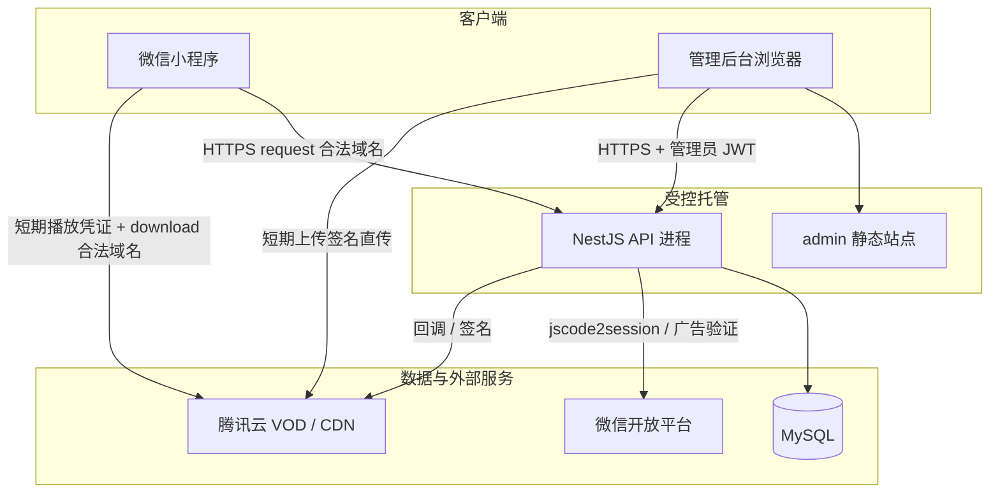

# 部署与运行组件

- 文档用途：说明数据库、服务器与各端的关系，以及本地开发与目标生产部署形态
- 更新日期：2026-08-14
- 本文描述目标部署拓扑和运行边界；工程实现进度与阻塞项见 [status.md](./status.md)，环境变量明细见 [configuration.md](./configuration.md)，上线勾选见 [release-checklist.md](./release-checklist.md)

## 1. 核心结论

| 问题 | 答案 |
| --- | --- |
| 数据库给谁用？ | **仅 NestJS API**（`apps/api`）通过 `DATABASE_URL` 连接 MySQL；小程序和管理后台**不直连数据库** |
| 微信小程序要不要服务器？ | 小程序本身**不需要**再搭一套业务服务器，但**必须**能 HTTPS 访问统一的 NestJS API |
| 管理后台要不要服务器？ | 需要**静态站点托管**（HTML/JS/CSS）；业务逻辑仍走同一套 API |
| 是否共用？ | **是**。观看端与管理端共用**一个模块化单体 API** 和**一个 MySQL**；视频走腾讯云 VOD/CDN，不在 API 机器上长期存片 |

权益、播放许可、奖励、审核和审计的**唯一事实来源**是 API + MySQL。客户端不能修改余额，不能持有长期媒体地址或数据库连接串。

## 2. 运行组件一览

| 组件 | 仓库路径 | 运行位置 | 是否连 MySQL | 主要对外地址 |
| --- | --- | --- | --- | --- |
| uni-app 微信观看端 | `apps/uniapp` | 用户微信客户端 | 否 | 编译后上传微信；运行时请求 `apiBaseUrl` |
| 原生过渡小程序 | `apps/miniprogram` | 用户微信客户端 | 否 | 同上（过渡对照，验收后弃用） |
| Vue 管理后台 | `apps/admin` | 浏览器 + 静态托管 | 否 | 例如 `https://admin.example.com` |
| NestJS API | `apps/api` | 云主机 / 容器 / PaaS | **是** | 例如 `https://api.example.com` |
| MySQL | Prisma schema | 云数据库或自建实例 | — | 仅 API 内网或受限网络可达 |
| 腾讯云 VOD/CDN | 外部 | 腾讯云 | 否 | 例如 `https://media.example.com` |
| 微信登录与激励广告 | 外部 | 腾讯微信 | 否 | API 服务端调用；AppSecret 只在 API |

在业务规模没有证据支持前，**不拆分微服务**。API 进程无本地业务状态，可横向扩展；并发正确性依赖数据库事务与唯一约束，见 [architecture.md](./architecture.md) §9。

## 3. 部署拓扑

### 3.1 目标生产形态



典型域名分工（示例，实际以发布工单为准）：

| 域名 / 用途 | 消费者 | 微信后台配置 |
| --- | --- | --- |
| `api.example.com` | 小程序、管理端、VOD/微信回调 | **request 合法域名** |
| `admin.example.com` | 运营浏览器 | 管理端 Origin / CORS 白名单（非微信域名项） |
| `media.example.com` | 小程序播放器 | **download 合法域名** |

请求流、回调流与媒体流的业务不变量见 [architecture.md](./architecture.md) §1。

### 3.2 本地内部体验形态

本地开发**不模拟完整生产托管**，而是用本机进程 + Docker MySQL 完成联调：

```text
本机 Node.js
├── npm run dev:api      → http://localhost:3000（连 Docker MySQL）
├── npm run dev:admin    → http://localhost:5174（Mock 或连本地 API）
└── npm run dev:uniapp   → 微信开发者工具导入 dist/dev/mp-weixin

Docker
└── docker compose mysql → localhost:3306
```

本地默认 `WECHAT_MODE=mock`、`VOD_MODE=mock`，仅用于内部体验；不能据此推断外部已可上线。启动步骤见仓库 [README.md](../README.md)。

## 4. 数据库

### 4.1 职责边界

- **存什么**：用户与管理员、剧目/剧集/权利/审核、权益账本、播放租约、回调事件、审计等（模型见 [`apps/api/prisma/schema.prisma`](../apps/api/prisma/schema.prisma)）。
- **谁读写**：只有 API 进程和经批准的迁移/种子/运维脚本。
- **谁不能碰**：小程序包、管理端构建物、日志、错误响应、Git 仓库中均不得出现 `DATABASE_URL` 或等价连接串。

### 4.2 本地开发

前置：Docker Desktop 可用。

```bash
cp .env.example .env
npm run db:up
npm run db:generate
npm run db:migrate
npm run db:seed
```

根目录 [`docker-compose.yml`](../docker-compose.yml) 启动 MySQL 8.4，默认库名 `microfocus`；连接串写在 `.env` 的 `DATABASE_URL`，不提交 Git。`npm run db:up` 等价于 `docker compose up -d --wait mysql`：compose 在容器 `Started` 后还会等到健康检查通过，否则立刻跑 `db:migrate` 可能遇到 `P1017`（连接被关闭）。

`npm run db:migrate` 走 Prisma `migrate dev`，会创建临时影子库，因此本地 `microfocus` 用户需要 `CREATE DATABASE` 权限。官方 MySQL 镜像默认只把该用户授权到业务库；仓库用 [`docker/mysql/init/01-grant-prisma-shadow.sql`](../docker/mysql/init/01-grant-prisma-shadow.sql) 在**首次初始化数据卷**时补齐。已有数据卷不会重跑 init，需一次性用 root 执行同样的 `GRANT`，或重建本地卷。

CI 与生产应用已有迁移时使用 `npm run db:migrate:deploy`，不创建影子库。

### 4.3 生产与 CI

| 场景 | 命令 | 说明 |
| --- | --- | --- |
| CI / 空白库首次部署 | `npm run db:migrate:deploy` | 应用 Prisma 迁移，不交互 |
| 发布验收 | 空白 MySQL + 脱敏数据烟测 | 见 [release-checklist.md](./release-checklist.md) §5 |
| 常规发布 | 先 migrate，再滚动更新 API | 迁移需向后兼容；见 architecture §9 |
| 灾难恢复 | 备份还原 + 对账补录 | 见 [operations.md](./operations.md)；**不能**用库还原做常规回滚 |

生产 MySQL 建议使用云厂商托管实例（如腾讯云 CDB），开启自动备份，网络仅允许 API 所在安全组访问。

## 5. 各端如何指向 API

客户端**不会**自动继承 API 进程的 `PUBLIC_API_URL`，必须通过受控构建或运行时配置注入公开 HTTPS 地址：

| 端 | 配置入口 | 为空时的当前行为 |
| --- | --- | --- |
| 管理后台 | `VITE_API_BASE_URL` | 进入 Mock 演示模式 |
| uni-app / 过渡小程序 | `RUNTIME_CONFIG.apiBaseUrl` | 当前无 Live 注入路径，外部包不可用 |

`PUBLIC_API_URL` 是 **API 服务端**用于生成绝对 URL 和校验部署环境的变量，与客户端构建变量分离。规则见 [configuration.md](./configuration.md) §4。

**当前工程阻塞**（解除前不得外部灰度）：

- 观看端与管理端缺少统一的 Live API URL 构建注入；
- 生产构建缺少 API 地址时必须失败的门禁尚未完全落地；
- uni-app 构建仍会注入 Demo 媒体地址。

细节与解除条件见 [status.md](./status.md) 与 [configuration.md](./configuration.md) §4.1。

## 6. 发布与托管分工

一次外部发布通常涉及以下动作（具体勾选见 [release-checklist.md](./release-checklist.md)）：

1. **API**：从同一 Git commit 构建，注入生产环境变量（含 `DATABASE_URL`、JWT/TOTP/VOD/微信秘密），部署并执行 `db:migrate:deploy`。
2. **管理后台**：构建静态资源，部署到 `admin` 域名；构建时写入 `VITE_API_BASE_URL=https://api.example.com`。
3. **微信小程序**：构建 uni-app 生产包，写入合法 `apiBaseUrl`，上传微信后台审核/发布。
4. **MySQL**：独立托管，不与 API 公网暴露；备份与恢复策略写入发布工单。
5. **微信 / VOD**：配置合法域名、回调 URL、广告位；秘密只进 API 环境。

同一发布记录应保存：Git commit、构建编号、非秘密环境快照（API 地址、admin Origin、AppID、VOD 子应用 ID、媒体域名），便于排查环境串用。

## 7. 明确不采用的方案

- 不为微信小程序单独部署一套业务 API 或独立权益账本。
- 不让管理后台直连 MySQL 做内容或账本修改。
- 不把 Demo/Mock 媒体或本地试播地址作为生产播放来源。
- 不为尚未证明的规模拆分微服务或多套数据库事实来源。

## 8. 相关文档

| 文档 | 内容 |
| --- | --- |
| [architecture.md](./architecture.md) | 信任边界、事务幂等、迁移与回滚约束 |
| [configuration.md](./configuration.md) | 环境变量分类、秘密暴露边界、微信/VOD 接入 |
| [release-checklist.md](./release-checklist.md) | 外部灰度与正式发布硬闸门 |
| [operations.md](./operations.md) | 备份恢复、事故与数据库恢复审批 |
| [status.md](./status.md) | 当前实现矩阵与工程阻塞 |
| [README.md](../README.md) | 本地启动与验证命令 |
