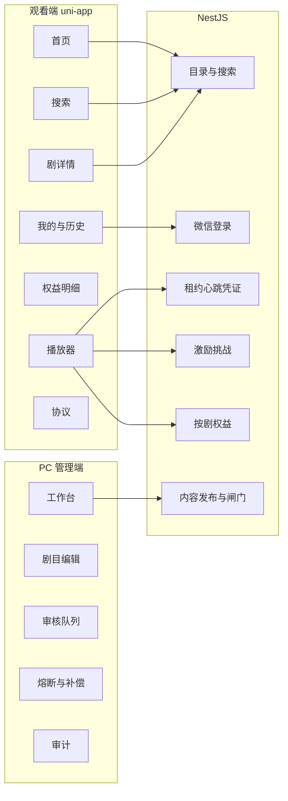

# 页面与 API 契约说明

- 文档用途：定义页面职责、接口语义、权限边界和验收关系
- 更新日期：2026-08-14
- 本文定义目标契约，可能包含尚未进入 `packages/contracts` 或代码的接口；本文**不记录任务进度、完成比例或待办事项**，工程状态统一见 [status.md](./status.md)
- 产品范围见 [product-plan.md](./product-plan.md)，详细需求见 [PRD](./prd-microfocus-movie-internal-validation.md)，技术不变量见 [architecture.md](./architecture.md)

观看端以 `apps/uniapp` 为产品实现边界；`apps/miniprogram` 仅作过渡对照，不形成第二套产品或接口契约。跨端共享的常量、类型和路由必须集中在 `packages/contracts`；健康检查和 provider 回调等纯服务端接口可以不暴露给客户端。

任何页面隐藏、按钮禁用或前端路由守卫都不是安全边界。用户身份、管理员角色、资源所有权、内容状态、权益余额和播放许可必须由服务端再次验证。

主用户路径：打开 → 选剧 → 免费前 2 集 → 拦截 → 看完激励广告 → 入账 600 秒（24h、仅本剧）→ 心跳扣秒 → 耗尽或过期暂停并保留进度。

---

## 一、运行模式与配置边界

| 模式 | API 与 provider | 允许用途 | 强制边界 |
| --- | --- | --- | --- |
| Demo / Mock | 明确启用 Mock 数据或本地媒体 | UI、文案和内部演示 | 必须显示内部体验标识；不得证明登录、广告收入、权益账本或正式播放成立 |
| 内部联调 | 使用可配置的 API Base URL、测试数据库和受控 provider | 页面—API、账本、租约及异常恢复联调 | API 地址必须显式注入；禁止静默回退 Mock；`client_attestation` 仅限书面批准的非生产内部验证 |
| Live | HTTPS 正式 API、真实微信登录、VOD 和可信广告验证 | 外部灰度与正式发布 | 配置缺失或 provider 未就绪时 fail-closed；不得自动降级 Mock |

观看端的 API Base URL 必须由受控的编译或部署配置提供。非 Demo 模式下地址为空、协议不安全或域名不在微信允许范围时，应在启动或首次请求前明确失败。

## 二、观看端页面（uni-app）

路由注册：`apps/uniapp/src/pages.json`。Tab：首页 / 剧场 / 我的。剧场不在主账本路径上。

客户端 HTTP 封装：`apps/uniapp/src/services/api.ts`，路径常量：`apps/uniapp/src/constants/routes.ts`。

### MVP 主路径

| 页面 | 源码 | 职责 | 对接接口 |
| --- | --- | --- | --- |
| 首页 | `apps/uniapp/src/pages/home/index.vue` | 分栏、分类入口和剧目发现 | `GET /v1/catalog`、`GET /v1/search` |
| 搜索 | `apps/uniapp/src/pages/search/index.vue` | 按剧名、简介和分类检索；展示推荐搜索与空状态 | `GET /v1/search`、`GET /v1/catalog` |
| 分类 | `apps/uniapp/src/pages/category/index.vue` | 按分类浏览公开剧目 | `GET /v1/search?category=...` |
| 短剧详情 | `apps/uniapp/src/pages/drama/index.vue` | 封面、简介、目录、免费/锁定状态和播放入口 | `GET /v1/dramas/:dramaId`；登录后可读权益 |
| 播放器 | `apps/uniapp/src/pages/player/index.vue` | 租约、短凭证、心跳、广告拦截、进度和异常恢复 | 播放、奖励、权益及进度接口 |
| 权益明细 | `apps/uniapp/src/pages/entitlements/index.vue` | 展示本剧余额、不可变批次和过期时间 | `GET /v1/entitlements/:dramaId` |
| 我的 | `apps/uniapp/src/pages/my/index.vue` | 显式登录、观看历史、继续观看和客服入口 | `POST /v1/auth/wechat`、`GET /v1/me/history` |
| 法律与隐私 | `apps/uniapp/src/pages/legal/index.vue` | 用户协议、隐私指引、广告权益、注销和投诉说明 | 静态内容或受控内容服务；不得依赖 Mock 文案发布 |

播放器调用（`pages/player` + `services/reward.ts` + `services/playback-controller.ts`）：

- 会话：`POST /v1/auth/wechat`（仅微信小程序；必须由用户操作显式触发）
- 租约：`POST /v1/playback/leases`、`POST .../heartbeats`、`POST .../renew`、`DELETE .../:leaseId`
- 进度：`PUT /v1/me/progress`
- 激励：`POST /v1/rewards/challenges`、`POST /v1/rewards/challenges/:id/complete`
- 入账后刷新：`GET /v1/entitlements/:dramaId`

### 非 MVP 主链路页面与交互

| 页面/交互 | 源码 | 产品边界 |
| --- | --- | --- |
| 剧场 | `apps/uniapp/src/pages/theater/index.vue` | 可用于 Demo 视觉验证；接入正式媒体时必须复用租约、权益和心跳，不得旁路播放 |
| 评论底栏 | `apps/uniapp/src/components/comment-sheet/index.vue` | 仅本地交互展示；MVP 不定义评论、点赞或回复接口 |
| 福利 | `apps/uniapp/src/pages/welfare/index.vue` | 签到、邀请和增长活动属于 Later，不得接入正式权益账本 |
| 收藏/点赞/预约/商城/消息 | `apps/uniapp/src/pages/my/index.vue` | 属于社交、会员、支付或运营扩展，不进入 MVP API |

不得仅为对齐外部产品界面而新增页面。若未来将剧场定义为正式推荐流，必须复用同一套租约、权益和心跳契约，不能使用 Demo URL 旁路播放；该变化需要独立产品决策。

基础分享只允许为 `PUBLISHED` 且权利有效的剧目生成卡片；Mock、未发布、下架或权利失效内容不得产生可外传链接。

---

## 三、管理端页面与权限

不模仿观看端 App 视觉。路由：`apps/admin/src/router.ts`。导航与角色过滤：`apps/admin/src/config/navigation.ts`。动作策略：`apps/admin/src/policies/admin.ts`。HTTP：`apps/admin/src/api/admin.ts`。

| 页面 | 路由 | 允许角色 | 职责 |
| --- | --- | --- | --- |
| 登录 | `/login` | 未登录 | 邮箱、密码、OTP 换管理员 JWT |
| 工作台 | `/` | EDITOR / REVIEWER / ADMIN | 内容状态和发布闸门摘要 |
| 剧目列表 | `/dramas` | EDITOR / REVIEWER / ADMIN | 按权限查看和筛选剧目 |
| 新建/编辑剧 | `/dramas/new`、`/dramas/:id` | EDITOR | 编辑本人负责的剧目、权利和媒体版本并提交审核 |
| 审核队列 | `/reviews` | REVIEWER | 通过或驳回；不得审核本人创建或编辑的版本 |
| 运营控制 | `/operations` | ADMIN | 熔断、人工补偿、账本纠错、回调积压列表/重放、注销查询令牌补发 |
| 审计日志 | `/audit` | ADMIN | 查询关键操作与系统事件 |

角色与关键动作（客户端策略，服务端仍以守卫为准）：

- EDITOR：创建、编辑和提交本人负责的剧目；服务端必须按 `editorId` 或等价所有权字段过滤写操作。
- REVIEWER：审核内容与媒体；不得审核本人创建或编辑的版本。
- ADMIN：发布、下架、熔断、补偿和审计；不得绕过权利、媒体、职责分离或发布闸门。
- 人工补偿秒数由事故或客服审批决定，不等同于广告默认奖励 600 秒；必须记录原因、过期时间、操作人和关联 challenge（如适用）。

前端导航与按钮只负责可用性提示；服务端必须对每个管理接口执行管理员 JWT、角色、所有权和资源状态校验。

明确不做：运营后台小程序、推荐运营报表、会员或支付后台。

---

## 四、HTTP 通用约定

### 4.1 响应与认证

- 成功响应统一为 `{ data, requestId }`，错误响应统一为 `{ code, message, requestId }`。
- 观看端使用 `Authorization: Bearer <viewer token>`：匿名 viewer token 只能申请和维护免费集租约，用户 JWT 才能访问锁定集、权益、奖励、历史和进度。管理员使用独立管理员 JWT，三种令牌不可互换。
- 公开接口仅限匿名 viewer 会话创建、微信登录、公开目录、搜索和已发布剧目详情。
- `Content-Type` 为 `application/json`；时间使用 ISO 8601 UTC 字符串；秒数使用非负整数。
- 未发布、下架、权利过期或不存在的公开内容统一返回 404，避免泄露内容状态。
- 匿名 viewer 会话可以在不触发微信授权的情况下创建，但必须绑定设备/会话、短期有效并接受限频。免费集租约只能签发给服务端判定为免费且已发布、权利有效、媒体就绪的集；锁定集、权益、奖励、历史和进度接口必须使用用户 JWT。
- 匿名观看进度只保存在本地，不写入用户历史。用户显式登录后，客户端提交本地剧目、剧集、媒体位置和更新时间；服务端以更新时间较新的有效进度为准合并，并避免重复历史记录。

### 4.2 幂等、分页与排序

- 完成奖励和人工补偿必须携带 `Idempotency-Key`；同一业务请求的重试返回同一 grant，不得重复发放。
- Provider 回调必须携带稳定事件 ID 并验证签名；重复事件不得重复改变状态。
- 搜索参数为 `q`、`category`、`page`；`page` 默认 1，`pageSize` 固定 20 且客户端不可修改，响应包含 `items/page/pageSize/total/totalPages`。
- 为防止恶意遍历拉爆数据库，最大允许访问的页数上限为 100（即最多返回前 2000 条结果），超过上限视为空结果。
- 搜索默认按 `recommendationRank DESC, publishedAt DESC`；`latest` 必须按 `publishedAt DESC`；同值时以稳定 ID 作次级排序。
- 空结果返回空数组及有效分页元数据，不使用 404。

### 4.3 典型错误语义

| HTTP | 稳定错误码 | 可重试性与客户端行为 |
| --- | --- | --- |
| 400 | `INVALID_CHALLENGE_NONCE`、`IDEMPOTENCY_KEY_REQUIRED`、`AD_NOT_COMPLETED` | 终态；严禁自动重试同一错误请求 |
| 401 | `UNAUTHORIZED` | 会话失效；清理令牌并由用户重新触发登录，严禁自动重试 |
| 401 | `ANONYMOUS_SESSION_EXPIRED` | 清理匿名 token 并重新创建匿名会话，不触发微信登录授权 |
| 403 | `FORBIDDEN`、`USER_TOKEN_REQUIRED` | 终态；展示登录或无权限状态，严禁自动重试 |
| 403 | `ENTITLEMENT_REQUIRED` | 用户可操作；展示广告权益拦截 |
| 403/503 | `CIRCUIT_OPEN`、`PROVIDER_CIRCUIT_OPEN`、`PROVIDER_NOT_CONFIGURED` | 暂不可用；停止当前链路，不自动降级 Mock |
| 404 | `NOT_FOUND` | 终态；返回上级页面或显示内容不可用，严禁自动重试 |
| 409 | `REWARD_NOT_VERIFIED` | 可重试；保留原 challenge 和幂等键后延迟重试 |
| 409 | `CHALLENGE_PENDING` | 复用原 challenge，不创建新的挑战 |
| 409 | `CHALLENGE_EXPIRED`、`CHALLENGE_NOT_PENDING` | 终态；刷新权益后再决定是否创建新挑战 |
| 409 | `HEARTBEAT_OUT_OF_ORDER`、`HEARTBEAT_ANCHOR_MISMATCH` | 刷新或重建租约，不重复扣费 |
| 409 | `INVALID_DRAMA_STATE`、`PUBLICATION_GATE_FAILED` | 管理端刷新资源与闸门状态 |
| 429 | `RATE_LIMITED` | 按服务端建议延迟重试，必须实现指数退避（Exponential Backoff）和随机抖动，禁止立即循环 |
| 502/503 | `PROVIDER_REQUEST_FAILED`、`PROVIDER_REJECTED` | 根据 provider 状态提示重试（需指数退避）或联系支持 |

客户端不得仅按 HTTP 状态猜测业务原因，必须同时处理稳定 `code`；未知错误进入通用恢复态并保留 `requestId` 供客服和审计查询。对于允许自动重试的场景，必须实现指数退避和随机抖动（Jitter）以防雪崩。

微信广告组件或 provider 的原始状态必须在适配层归一化为 `AD_NO_FILL`、`AD_FREQUENCY_LIMITED`、`AD_LOAD_FAILED`、`AD_NOT_COMPLETED` 或 `AD_VERIFICATION_PENDING`。其中无填充、频限和加载失败必须具有不同文案与重试策略，不得互相猜测或混用。

## 五、后端接口

实现位置：`apps/api/src/*/`.module.ts。观看端路径与 `packages/contracts` 对齐。

### 5.1 观看端

| 方法与路径 | 认证 | 关键请求 | 关键响应/语义 |
| --- | --- | --- | --- |
| `POST /v1/auth/anonymous` | 公开、按连接 IP 限频（新建会话）；刷新已有 device/session 不占桶 | `deviceId/sessionId` | 短期匿名 viewer token；不代表微信登录，不得访问用户权益或历史 |
| `POST /v1/auth/wechat` | 公开、用户显式触发、按连接 IP 限频 | `code` | 用户 JWT；H5/App 不得复用 |
| `GET /v1/catalog` | 公开、按连接 IP 限频 | 无 | `featured/latest/popular/categories`；只含已发布且权利有效内容；`latest` 按发布时间倒序，不从推荐榜重排 |
| `GET /v1/search` | 公开、按连接 IP 限频 | `q/category/page` | 分页剧卡；`pageSize` 固定 20；超过第 100 页返回空结果；空结果为 `items: []` |
| `GET /v1/dramas/:dramaId` | 公开、按连接 IP 限频 | 路径 ID | 剧目与按集目录；免费集由服务端规则计算 |
| `GET /v1/me/history` | 用户 JWT；按认证用户限频 | 无 | 观看历史，按最近更新时间排序 |
| `PUT /v1/me/progress` | 用户 JWT；按认证用户限频 | `dramaId/episodeId/mediaPositionSeconds` | 幂等保存有效进度；不得写未发布内容 |
| `GET /v1/entitlements/:dramaId` | 用户 JWT；按认证用户限频 | 路径 ID | 账本结余、扣除活动 reservation 后的可分配余额、最近过期时间和不可变批次 |
| `POST /v1/rewards/challenges` | 用户 JWT；按认证用户限频（5 分钟 3 次） | `dramaId/sessionId` | challenge、nonce、过期时间、广告位和验证模式 |
| `POST /v1/rewards/challenges/:challengeId/complete` | 用户 JWT + `Idempotency-Key`；按认证用户限频 | `nonce/isEnded/clientCompletedAt` | 可信验证通过后返回唯一 grant；未验证时保留原 challenge |
| `POST /v1/playback/leases` | viewer token；锁定集必须为用户 JWT；按认证主体限频 | `episodeId/deviceId` | 服务端重新判断免费状态；锁定内容预留首个短窗口预算，返回租约、外层 120 秒凭证、窗口授权、心跳周期和可分配余额 |
| `GET /v1/playback/leases/active` | 用户 JWT；按认证用户限频 | 无 | 查询本人活动租约、预留、未确认窗口和恢复动作；不依赖客户端保存旧 lease ID |
| `POST /v1/playback/leases/:leaseId/heartbeats` | 租约所属 viewer token；按认证主体限频 | `seq`、前后媒体位置、倍速、播放状态、已使用窗口标识 | 结合服务端媒体授权/交付证据确认上一预留并签发下一短窗口；仅活动租约和递增序列结算。存在 UNCONFIRMED 窗口时 `debitedSeconds=0` 且 `reason=UNCONFIRMED_EXPOSURE`，不自动扣费 |
| `POST /v1/playback/leases/:leaseId/renew` | 租约所属 viewer token；按认证主体限频 | 当前租约 | 最近心跳合规时续签短凭证 |
| `POST /v1/playback/leases/:leaseId/recover` | 用户 JWT + 近期重新认证证明；按认证用户限频 | `reason/deviceId/wechatCode` | 核验媒体交付证据后幂等结算、释放或转客服；无真实 VOD 交付日志时 UNCONFIRMED 只释放不扣费；自动宽限受滚动风险上限约束 |
| `DELETE /v1/playback/leases/:leaseId` | 租约所属 viewer token；按认证主体限频 | 当前租约 | 主动关闭；重复关闭不得产生额外扣费 |

### 5.2 管理端

除登录接口外，所有管理接口均需管理员 JWT；表中角色是服务端必须执行的最小权限。写操作（POST/PATCH/PUT/DELETE）和只读 GET 分别按认证管理员身份限频，分桶计数，不使用可伪造的客户端字段。登录仍单独按 IP+邮箱限频。

| 方法与路径 | 角色 | 所有权/状态约束 | 用途 |
| --- | --- | --- | --- |
| `POST /v1/admin/auth/login` | 公开、按连接 IP + 邮箱限频 | 邮箱、密码、OTP | 换管理员 JWT |
| `GET /v1/admin/dashboard` | 全部管理员角色 | 无写权限 | 状态计数、闸门摘要、回调积压/死信/打开的 provider 熔断、最近一次权益对账差异 |
| `GET /v1/admin/release-gate` | 全部管理员角色 | 只读 | 对外流量闸门 |
| `GET /v1/admin/dramas`、`GET .../:id` | 全部管理员角色 | EDITOR 只能访问授权范围 | 列表和详情 |
| `POST /v1/admin/dramas` | EDITOR | 创建者成为负责人；标题/简介/标签/集数有长度与数量上限 | 创建草稿 |
| `PATCH /v1/admin/dramas/:id` | EDITOR | 仅本人负责且可编辑状态；字段上限与创建一致 | 修改元数据 |
| `POST .../:id/rights` | EDITOR | 仅本人负责；新版本使内容回到待审链路；权利人/证号/材料键限长 | 写入不可覆盖的权利版本 |
| `POST .../:id/media-assets`、`POST /uploads/sign` | EDITOR | 仅本人负责；禁止修改已发布内容 | 登记媒体版本和获取短期上传签名 |
| `POST .../:id/submit-review` | EDITOR | 仅本人负责，材料完整 | 提交审核 |
| `GET /v1/admin/reviews` | REVIEWER | 只返回待审内容 | 审核队列 |
| `POST .../:id/review`、`PATCH /media-assets/:assetId/review` | REVIEWER | 禁止自审，结论进入审计 | 内容和媒体审核 |
| `POST .../:id/publish`、`POST .../:id/offline` | ADMIN | 必须满足状态、权利、媒体和发布闸门 | 发布与下架；权利到期后系统也会自动下架并撤销活动租约 |
| `GET /v1/admin/audit-logs` | ADMIN | 只读、不可篡改；列表含写入时的 `requestId`，可按该字段检索 | 审计查询，可与 HTTP 访问日志关联 |
| `GET/PATCH /v1/admin/circuit-breakers...` | ADMIN | 记录范围、原因和操作者；`updatedBy` 为管理员 ID 或 `system:*` 作业标识 | 全局/用户/剧目/广告位/provider 熔断 |
| `POST /v1/admin/entitlements/compensate` | ADMIN + `Idempotency-Key` | 关联用户、剧目、秒数、过期时间、原因及原 challenge（如适用） | 创建不可变补偿批次 |
| `POST /v1/admin/entitlements/adjustments` | ADMIN + `Idempotency-Key` | adjustment 类型、原事实/冻结记录 ID、秒数、原因和审批记录 | 在账本锁定边界内追加冻结、释放冻结或核销事实；禁止直接改 grant/debit |
| `GET /v1/admin/callback-events` | ADMIN | 默认积压状态；不含加密载荷 | 列出回调事件元数据（状态、尝试次数、是否仍有可执行载荷） |
| `POST /v1/admin/callback-events/:eventId/replay` | ADMIN + `Idempotency-Key` | 死信事件 ID、原因和审批记录 | 将 RETRYABLE_FAILURE/DEAD_LETTER 事件受审计地迁回 PROCESSING，沿用原 provider 事件幂等键；保留期内若有加密规范化载荷则立即执行；超过 30 天密文会被清除，重放只解锁 |
| `GET /v1/admin/deletion-requests` | ADMIN | `userId` | 返回该用户最近一条注销申请状态，不含查询令牌明文 |
| `GET /v1/admin/deletion-requests/:deletionRequestId` | ADMIN | 路径 ID | 返回申请状态，不含查询令牌明文 |
| `POST /v1/admin/deletion-requests/:deletionRequestId/query-tokens` | ADMIN + `Idempotency-Key` | 已核验 `userId`、原因和审批记录 | 客服身份核验后轮换查询令牌摘要并延长有效期；新令牌只在首次成功响应出现一次；不恢复用户 JWT |

### 5.3 用户注销与数据请求

| 方法与路径 | 认证 | 语义 |
| --- | --- | --- |
| `POST /v1/me/deletion-requests` | 用户 JWT + 近期重新认证证明；按认证用户限频；幂等重放不占桶 | 请求体含确认文案与一次性 `wechatCode`；在同一事务内创建幂等申请、保存查询令牌摘要、标记账户不可用并撤销会话/活动租约/新奖励能力；事务提交后返回 `deletionRequestId/status/deletionQueryToken/tokenExpiresAt`，与响应追踪字段 `requestId` 区分 |
| `GET /v1/me/deletion-requests/:deletionRequestId` | `X-Deletion-Query-Token`；验令牌前按连接 IP 限频；同一令牌成功查询另有 1 秒冷却 | 查询 `PENDING/PROCESSING/COMPLETED/REJECTED`、处理时间和可理解原因 |

`deletionQueryToken` 只能查询对应申请，服务端仅保存摘要并执行限频；有效期应覆盖承诺的最长处理窗口。令牌遗失或过期后只能通过受控客服身份核验恢复查询能力，不能恢复已撤销的用户会话。管理员补发会作废旧令牌。

注销处理必须依据保留矩阵删除或匿名化可删除数据。依法或为权益、版权、安全和审计必须保留的记录应最小化、限制访问并与直接身份标识隔离；不得通过注销删除权益账本、事故证据或管理员审计事实。

### 5.4 系统与回调

| 方法与路径 | 认证 | 语义 |
| --- | --- | --- |
| `GET /health/live` | 受基础设施访问策略保护 | 进程存活，不查库、不返回秘密 |
| `GET /health/ready`、`GET /health` | 受基础设施访问策略保护 | 就绪：数据库可连且进程未进入关闭排水；失败返回 `NOT_READY`，不泄露连接串 |
| `GET /docs` | 仅非生产 | OpenAPI/Swagger；`NODE_ENV=production` 不挂载 |
| `POST /v1/callbacks/vod` | Provider 签名 + 事件 ID；验签前按连接 IP 限频 | 转码和审核结果；事件幂等，失败可重试 |
| `POST /v1/callbacks/reward` | Provider 签名 + 事件 ID；验签前按连接 IP 限频 | 可信广告完成验证；通常更新 PENDING challenge。若事件在允许延迟窗口内且证明广告在原有效期内完成，可将 EXPIRED 迁为 COMPLETED_LATE，仍只创建唯一 grant |

---

## 六、状态机与允许动作

| 对象 | 主要状态 | 关键规则 |
| --- | --- | --- |
| 剧目 | `DRAFT → PENDING_REVIEW → READY → PUBLISHED → OFFLINE` | 编辑产生新内容版本并回到审核链路；只有 READY 可发布；PUBLISHED 不可直接改内容 |
| 媒体处理 | `mediaStatus: CREATED / UPLOADING / PROCESSING / READY / FAILED` | 只描述文件与媒体处理，不代替审核结论 |
| 媒体审核 | `transcodeStatus`、`machineReviewStatus`、`manualReviewStatus`、`wechatReviewStatus` 分维度记录 | 只有媒体和转码 READY，且机审、人工审核、微信审核全部 APPROVED 时，媒体版本才整体可发布 |
| Challenge | `PENDING → COMPLETED / EXPIRED / REJECTED`；受控晚到验证 `EXPIRED → COMPLETED_LATE` | 晚到迁移仅限可信 provider 证明广告在原 challenge 有效期内完成且事件处于允许回调延迟窗口；所有完成状态共享唯一 grant 约束 |
| 播放租约 | `ACTIVE → REVOKED / CLOSED / EXPIRED` | 同一用户只有一个锁定内容活动租约；新租约撤销旧租约 |
| 播放预留 | `RESERVED → CONFIRMED / RELEASED / UNCONFIRMED` | 每个锁定媒体窗口最多预留一个小结算周期；未确认暴露达到上限后停止签发新窗口和新租约；无 VOD 交付日志时 UNCONFIRMED 不得自动转为扣费 |
| 权益账本 | 发放、消费和 adjustment 事实不可变 | grant 的来源、初始秒数、剧目、过期时间不可修改；消费追加 debit，冻结、释放冻结和核销追加 adjustment。单笔 grant 的结余按初始秒数减 debit 和未释放冻结重建；总账本结余为未过期 grant 结余之和。可分配余额再扣除活动 reservation，二者均不得为负；`WRITE_OFF` 不再次改变用户余额 |

状态变化必须由服务端执行并写入审计或业务事件；客户端不得本地推进权威状态。

## 七、页面—API—验收追踪

| 用户目标 | 页面/API | 最小验收 |
| --- | --- | --- |
| 发现可播放内容 | 首页、搜索、详情；catalog/search/drama | 仅返回已发布且权利有效内容；分页、空态和下架一致 |
| 免费试看 | 详情、播放器；anonymous auth/leases/heartbeats | 免费集不扣权益；匿名进度仅本地保存；登录后按更新时间合并有效进度 |
| 广告换时长 | 播放器；reward challenge/complete/callback | 未完成不发奖；重试幂等；验证中/失败可恢复 |
| 锁定内容播放 | 播放器；leases/heartbeats/renew | 服务端鉴权、单活租约、短窗口预算、5 秒心跳、15 秒离线宽限；停止心跳不能继续获得媒体窗口 |
| 恢复观看 | 我的、播放器；history/progress | 登录后恢复正确剧集和进度；失效内容不可续播 |
| 内容发布 | 管理端；rights/media/review/publish | 创建与审核职责分离；权利、媒体、闸门全部通过 |
| 事故控制 | 运营控制；offline/circuit/compensate/audit | 停止新凭证或奖励；账本与审计不删除；补偿可追溯 |

## 八、契约维护规则

- 所有被前端调用的路径、共享请求/响应类型、枚举和核心常量必须进入 `packages/contracts`；客户端不得维护语义不同的重复常量。
- 增加或修改接口时，应同时更新共享契约、服务端校验、调用方、错误码说明和最小验收测试。
- 路径兼容性变化需要版本化；不得在同一 `/v1` 路径下静默改变字段含义、认证方式或幂等语义。
- 页面存在、接口存在和端到端通过是不同概念；本文只定义应有契约，不据此推断工程完成度。
- 真实工程状态、验证命令和未完成事项只写入 `status.md`，不写入本文。

## 九、范围外能力

Later / 明确不做：推荐个性化、跨剧通用额度、会员去广告、支付、增长活动、社交/弹幕、管理端小程序、Android 客户端。

不要新开：收藏、点赞、签到、邀请、商城、H5 微信登录。H5/App 若以后要登录，需独立身份，不走 `/v1/auth/wechat`。
