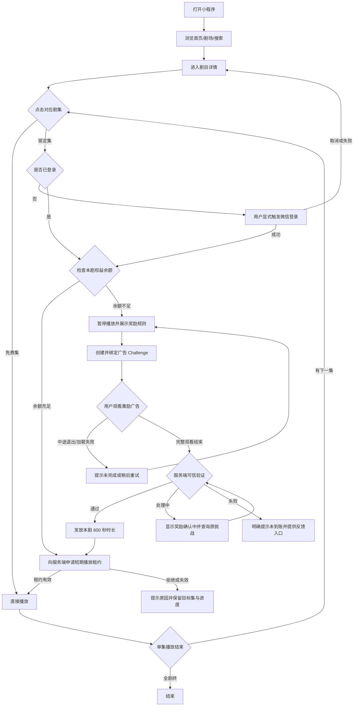
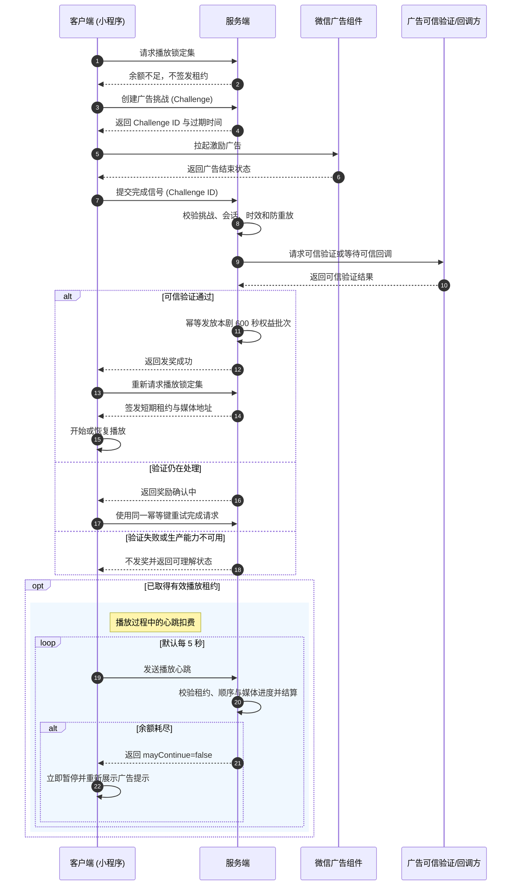

# 微焦短剧小程序 PRD

- 文档类型：产品需求文档
- 版本：MVP / 内部验证版
- 更新日期：2026-08-14
- 产品负责人：待确认
- 关联文档：[给甲方的说明](./client-brief.md)、[产品计划](./product-plan.md)、[发布清单](./release-checklist.md)、[页面与 API 对照](./pages-and-apis.md)
- 对外发送时以 [给甲方的说明](./client-brief.md) 为封面；本文是目标规格，不代表现网已上线

## 1. 产品决策

本产品面向微信内短剧观看场景，采用“免费试看 + 激励广告换继续观看时长”的核心模式。

本版本的产品决策是：

- 前 2 集免费试看。
- 用户完成一条激励广告后，获得当前剧目限定的观看时长。
- 默认奖励为 600 秒，默认有效期为 24 小时。
- 奖励只对当前剧目有效，不建立跨剧通用额度。
- 观看端优先支持微信小程序；管理端使用 PC Web。
- 会员、单剧付费、虚拟支付和视频号联动不纳入本版本。

### 1.1 范围优先级

- **P0 / 内部验证主路径**：目录与详情、免费试看、显式登录、广告挑战、可信验证、按剧权益、播放租约与心跳、历史恢复，以及管理端审核、发布、下架、熔断、补偿和审计。
- **P1 / 外部灰度前完善**：规则易读展示、基础分享、客服反馈、隐私与注销能力、真实 provider 错误分类和完整观测指标。P1 不得阻塞当前工程收口，但必须在外部灰度前逐项验收。
- **Later / 另行决策**：个性化推荐、社交互动、签到邀请、会员与支付、跨剧额度、复杂风控画像、自动封禁和独立黑名单后台。

本 PRD 描述 MVP 目标状态，不代表所有条目都在当前迭代开发；具体实施节奏以[产品计划](./product-plan.md)为准，页面与接口的稳定契约见[页面与 API 对照](./pages-and-apis.md)，当前工程状态统一见[项目状态](./status.md)。

## 2. 产品概述与定位

### 2.1 一句话定位

微焦短剧是一款让用户在微信内快速发现和观看短剧，通过免费试看和激励广告获得连续观看体验的小程序。

### 2.2 产品价值

对用户：降低开始观看短剧的门槛，并在试看结束后提供清晰、可控的继续观看方式。

对内容方：通过内容审核、权利信息和发布控制，管理短剧内容在微信内的播放。

对平台运营方：用可审计的广告挑战和观看权益账本，控制奖励发放、播放许可和内容下架风险。

## 3. 用户问题、目标用户与场景

### 3.1 用户问题

用户在微信内发现短剧后，希望快速开始观看；当免费内容结束时，希望知道继续观看需要付出什么、能获得多少观看时间，以及权益何时失效。

平台需要在用户体验、广告收益、版权授权和内容合规之间建立可控制的交换机制。

### 3.2 目标用户

- 在微信内打开小程序的短剧观众。
- 愿意先观看免费内容，再决定是否完成激励广告。
- 主要诉求是连续观看同一部剧，而不是获取跨剧通用权益。

### 3.3 典型使用场景

1. 用户在首页或搜索页发现一部短剧。
2. 用户进入详情页查看简介、封面、集数和试看范围。
3. 用户观看前两集免费内容。
4. 用户点击锁定集，了解广告奖励规则。
5. 用户完成广告后继续观看同一部剧。
6. 用户离开后再次打开小程序，从历史记录恢复观看。

## 4. 产品目标与非目标

### 4.1 产品目标

- 让用户在 3 步内从发现页进入剧目详情并开始播放。
- 让用户明确理解免费集、锁定集、广告奖励、有效期和适用范围。
- 让完整广告奖励能够被服务端安全记录，并按实际播放进度消费。
- 让运营人员能够发布、审核、下架和审计短剧内容。
- 让播放、权益和内容状态在异常情况下保持可恢复、可审计。

### 4.2 非目标

- 不做会员、单剧付费、虚拟支付或跨剧通用额度。
- 不做推荐个性化、社交、弹幕、复杂增长活动和直播。
- 不做运营后台小程序；运营后台为 PC Web。
- 不引入未经授权的第三方代码、素材、闭源 SDK、密钥或品牌资源。
- 不把 Mock 广告、Mock 登录或本地视频作为商业化能力证明。
- 不在没有真实资质、版权和 provider 的情况下对外发布。

## 5. 核心用户流程

以下是用户从发现短剧到解锁观看的核心体验流程：

### 5.1 发现与试看

1. 用户打开小程序。
2. 首页展示短剧卡片、封面、标题和必要标签。
3. 用户可通过首页、剧场或搜索进入剧目详情。
4. 详情页展示简介、集数目录、免费/锁定状态和最近观看进度。
5. 用户点击免费集进入播放器。

### 5.2 锁定集与广告奖励

1. 用户点击锁定集。
2. 未登录用户显式完成微信登录；取消或失败时返回详情页并保留免费浏览能力。
3. 页面展示奖励说明：完成一条激励广告，为本剧增加约 N 集观看时间，24 小时内有效。
4. 用户确认后创建广告挑战。
5. 用户观看激励广告。
6. 广告完整结束后提交完成信号。
7. 服务端完成可信验证后发放当前剧目的观看时长权益；验证延迟时查询同一 challenge。
8. 用户返回播放器，继续观看目标集。

### 5.3 回看与恢复

1. 用户进入“我的”。
2. 页面展示最近观看剧目、剧集和播放进度。
3. 用户点击历史卡片恢复到对应剧集和进度。
4. 若权益已耗尽或过期，页面提示重新完成广告。

## 6. 信息架构与页面职责

### 6.1 观看端

| 页面 | MVP 状态 | 主要职责 |
| --- | --- | --- |
| 首页 | P0 主路径 | 展示可播放短剧、热门内容和搜索入口 |
| 剧场 | 内部 Demo / Later | 当前仅验证沉浸式视频流和互动布局；接入正式内容前必须复用租约与扣费主链路 |
| 搜索 | P0 主路径 | 搜索剧名/简介，展示快捷入口、热搜和结果 |
| 剧目详情 | P0 主路径 | 展示剧目信息、集数目录、免费/锁定状态和播放入口 |
| 播放器 | P0 主路径 | 播放视频、保存进度、处理权益拦截和播放心跳 |
| 福利 | 内部 Mock / Later | 当前仅展示激励广告或活动规则，不接入真实权益账本，不作为商业化证明 |
| 我的 | P0 主路径 | 展示登录状态、观看历史、权益信息和设置入口 |
| 法律与隐私 | 外部灰度 P1 | 展示用户协议、隐私指引、广告权益说明、注销和投诉入口 |

### 6.2 管理端

| 页面/模块 | 主要职责 |
| --- | --- |
| 登录 | 管理员身份验证和角色进入 |
| 仪表盘 | 展示内容、审核、播放和系统概况 |
| 剧目管理 | 新建、编辑、查看和下架剧目 |
| 媒体处理 | 上传授权、媒体处理状态和媒体审核 |
| 审核队列 | 内容审核、权利审核和发布前检查 |
| 运营管理 | 管理发布状态、熔断和权益补偿 |
| 审计日志 | 查询关键管理操作和系统事件 |

MVP 仅实现服务端基础限频、异常记录和审计查询，不新增独立黑名单后台；可视化黑名单与复杂风控策略列入 Later，需根据真实作弊与误伤数据另行立项。

## 7. 功能需求

### 7.1 首页与搜索

- 首页展示可播放的已发布剧目。
- 未发布、已下架、权利失效或媒体未就绪的剧目不得出现在观看端。
- 搜索默认匹配剧名和简介，不以标签匹配替代真实搜索语义。
- 搜索结果支持分页、空状态和加载失败提示。
- 首页和搜索页必须提供明确的加载、空结果和网络错误状态。

### 7.2 剧目详情与目录

- 展示封面、标题、简介、标签、集数和最近观看进度。
- 每集显示集数、标题和可观看状态。
- 免费集可直接播放；锁定集进入权益拦截流程。
- 直接构造播放器 URL、修改集数参数或重复请求不得绕过服务端鉴权。
- 详情页需要说明奖励的观看时长、有效期和剧目范围。
- 外部灰度前支持微信原生卡片分享（右上角或页面内按钮），分享卡片展示剧目封面、剧名和简介，用户点击卡片可直接进入该剧目详情页；未发布、已下架、Mock 或内部体验内容不得生成可外传分享卡片。

### 7.3 播放器

- 支持播放、暂停、恢复、进度保存和播放错误提示。
- 免费集不扣除权益。
- 锁定集必须先取得有效播放租约。
- **自动连播**：单集结束时，若下一集是免费集或当前权益余额 > 0，自动无缝连播下一集；若余额为 0 且下一集是锁定集，自动暂停并弹出广告激励面板。
- **中途拦截**：若当前余额不足以看完本集，在播放过程中余额耗尽时，播放器需立即暂停，并弹出“时长已耗尽，看广告继续”的拦截浮层，获取权益后无缝续播。
- **心跳与离线宽限**：播放器默认每 5 秒向服务端上报一次心跳；断网或未收到有效心跳超过 15 秒时暂停锁定内容，恢复后重新申请或续签租约。数值调整必须同步契约、客户端、服务端和测试。
- **服务端可强制计费边界**：锁定内容按租约绑定的短媒体窗口交付，每次只预留一个小结算周期；服务端媒体授权/交付证据与合理递增心跳共同确认后才扣费。停止心跳不能继续取得新窗口，暂停、缓冲或确认未交付的窗口释放预留且不扣费。
- **多设备单活**：同一用户同一时间仅允许一个锁定内容活动租约。新设备取得租约后撤销旧租约；旧设备收到租约撤销结果时暂停并提示“已在其他设备开始播放”，新设备正常继续。
- 暂停、缓冲、后台状态不应产生错误扣费。
- 播放租约短期有效，失效后需要重新取得租约。
- 进度保存失败时，播放器继续保持当前状态并提示稍后重试。

### 7.4 激励广告与权益

以下是广告发奖与播放鉴权的系统时序交互：

- 广告挑战必须绑定用户、剧目、广告位、设备/会话和过期时间。
- 广告开始前创建挑战，避免客户端凭空提交奖励。
- 只有广告完整结束且服务端验证通过时，才允许发放权益。
- 广告中途关闭、加载失败、无填充或验证失败时不得发奖。
- 同一挑战的重复完成请求必须幂等，不得重复创建权益批次。
- 验证延迟时保留原挑战，允许查询或重试，不创建新挑战。
- 生产环境的可信验证或可信回调是发奖必选条件；能力不可用时保持 fail-closed，不得仅凭客户端广告结束事件发奖。
- `client_attestation` 仅允许用于明确标识的非生产内部技术验证，不得用于外部灰度、商业化验证或正式环境；外部灰度与正式环境统一要求 `server_verified`。
- 广告无填充、频次限制和其他 provider 错误必须按明确错误码分类，不得推测原因或把无填充展示成“今日次数已达上限”。
- MVP 不新增 challenge 查询接口：客户端使用原 challenge、nonce 和同一 `Idempotency-Key` 重试 `POST /v1/rewards/challenges/:id/complete`；`REWARD_NOT_VERIFIED` 表示仍在确认，成功响应返回唯一 `grantId`，过期或拒绝返回终态错误。客户端随后刷新本剧权益接口确认到账。
- 完整观看后若奖励长时间未确认，用户可提交携带 challenge ID 的反馈；人工补偿前必须核对原挑战和既有权益批次。补偿后客户端通过本剧权益接口查询结果，MVP 不承诺站内推送通知。
- 权益批次不可变，消费按 FEFO 规则进行，不得出现负余额。
- 默认奖励为当前剧目 600 秒、24 小时内有效。

### 7.5 登录与“我的”

- 用户未登录时可浏览公开目录和免费内容。
- 登录必须由用户显式触发，不在小程序启动时隐式授权。
- 用户首次尝试播放锁定集或创建广告挑战时触发登录；取消或失败后返回原页面，仍可浏览和播放免费内容。
- 登录成功后保留当前剧目、目标集和本地播放进度；若服务端已有更新进度，以服务端记录为准并避免重复创建历史记录。
- 登录后展示观看历史、播放进度和当前剧目权益。
- **余额可视化**：在“我的”页面及播放器选集面板中，需将剩余秒数转化为易读格式（如“剩余观看时长：10分00秒”），或预估提示“当前时长约可看 X 集”。
- **客服入口**：“我的”页面需提供基础的“联系客服”或“意见反馈”入口（可使用微信小程序原生客服能力），以便处理“看广告未发奖”等客诉问题。
- 真实微信登录通过服务端换取会话；客户端不得保存微信 `session_key`。
- 登录失败、取消授权或会话过期时，保留未登录浏览能力。

### 7.6 管理与发布

- 剧目必须完成媒体、权利和内容审核后才能发布。
- 发布前校验发行许可、授权期限、微信传播权、广告变现权、转码权和宣传物料权。
- 下架后不得签发新的播放租约。
- 权利到期应触发下架或阻断发布。
- 人工补偿必须关联用户、剧目、原因、原 challenge（如适用）和操作人；重复请求必须幂等，补偿结果通过本剧权益接口可查询。
- 发布、审核、下架、补偿和熔断操作必须写入审计日志。

## 8. 业务规则与权益规则

| 规则 | 默认值/要求 |
| --- | --- |
| 免费集数 | 前 2 集 |
| 广告奖励 | 完成 1 条激励广告后增加观看时长 |
| 奖励时长 | 600 秒 |
| 奖励有效期 | 24 小时 |
| 权益范围 | 仅当前剧目 |
| 消费方式 | 服务端按短媒体窗口交付证据与确认播放进度结算，FEFO 消费；客户端心跳不作为唯一计费证据 |
| 免费集消费 | 不扣权益 |
| 广告未完成 | 不发奖，可重试 |
| 重复提交 | 幂等返回，不重复发奖 |
| 播放许可 | 短期租约，服务端签发 |
| 播放心跳 | 默认每 5 秒；仅活动租约、顺序有效且媒体进度前进时结算 |
| 离线宽限 | 15 秒；超时暂停锁定内容并重新取得或续签租约 |
| 并发播放 | 同一用户仅一个锁定内容活动租约，新租约撤销旧租约 |
| 余额状态 | 不允许负数 |
| Provider 未就绪 | 生产环境 fail-closed，不自动降级 Mock |

## 9. 异常场景与恢复机制

| 场景 | 用户表现 | 系统行为 |
| --- | --- | --- |
| 广告加载失败 | 显示“广告暂不可用，请稍后重试” | 不发奖，不消耗已有权益 |
| 广告库无填充 (No Fill) | 显示“暂时没有广告可看，请稍后再试” | 不发奖，允许稍后重试 |
| Provider 明确返回频次限制 | 按返回信息显示“暂时无法继续获取奖励”及可重试时间（若有） | 不拉起广告、不发奖；不得将无填充误判为频次限制 |
| 用户中途关闭广告 | 显示未完成提示 | 挑战不记为成功，可按规则重试 |
| 服务端验证延迟 | 显示“奖励确认中” | 保留同一 challenge，允许查询/重试 |
| 服务端验证失败 | 显示“奖励未到账，可重试查询或反馈” | 不发奖；保留失败原因和审计信息，不静默失败 |
| 触发基础风控 | 显示“奖励正在核验”或明确的受限状态 | 不立即发奖；保留原 challenge，进入可审计复核流程 |
| 网络中断 | 播放暂停并提示恢复 | 在离线宽限期内允许恢复，超时后重新取得租约 |
| 播放心跳超时 | 播放停止或进入恢复态 | 不继续扣费，重新校验租约和额度 |
| 权益过期 | 显示过期时间和继续观看入口 | 过期批次不可消费 |
| 剧目下架 | 显示内容暂不可用 | 停止签发新播放租约 |
| 登录失败 | 保留当前页面 | 允许继续浏览无需登录的内容 |
| 播放地址失效 | 显示播放失败 | 不泄露长期媒体地址，允许重新申请短期租约 |

## 10. 指标、埋点与验证方式

### 10.1 核心指标

| 指标 | 定义 | 目标用途 |
| --- | --- | --- |
| 详情进入率 | 点击剧卡后成功进入详情的比例 | 判断发现路径是否顺畅 |
| 第 2 集完播率 | 开始第 2 集后完成播放的比例 | 判断内容和播放体验 |
| 锁定集拦截理解率 | 用户能复述奖励规则的比例 | 判断文案是否清晰 |
| 广告尝试率 | 触发拦截后点击广告的比例 | 判断交换意愿 |
| 广告拉起成功率 (Fill Rate) | 用户点击看广告后，成功拉起微信广告的比例 | 区分用户主动放弃和平台无广告可播问题 |
| 广告完成率 | 广告开始后完整结束的比例 | 区分用户流失和广告填充问题 |
| 奖励到账成功率 | 广告完成后验证并成功入账的比例 | 判断权益链路可靠性 |
| 广告后回看率 | 广告完成后 24 小时内回到同一剧目的比例 | 验证按剧权益假设 |
| 错误扣费数 | 非播放状态导致的错误扣费次数 | 必须为 0 |

### 10.2 埋点要求

至少记录以下事件：剧卡点击、详情进入、集数点击、播放开始、播放暂停、播放完成、锁定拦截展示、广告开始、广告结束、广告失败、挑战创建、奖励确认、权益到账、租约创建、心跳成功/失败、播放错误和下架阻断。

事件不得包含密钥、微信 `session_key`、完整请求体或其他敏感信息。

每个核心指标必须在灰度前补齐事件口径、分母、去重规则、观察窗口、数据负责人和复盘日期。广告漏斗应至少区分“用户点击、广告成功拉起、完整结束、可信验证通过、权益到账”，避免把无填充、用户中退和服务端失败混为同一流失。

### 10.3 验证阶段与决策标准

- **内部任务测试**：每轮固定 5 人，其中至少 3 人在最近 30 天有微信内短视频或短剧观看经历；不给规则提示，并明确允许随时退出，要求完成“试看结束 → 理解规则 → 看广告 → 继续播放 → 额度耗尽/过期”。至少 4 人能主动复述“仅本剧、约可看 N 集、24 小时有效、未看完不发奖”，且至少 3 人主动选择广告路径，才进入下一阶段；仅 1–2 人选择时先调整文案或参数并重测，0 人选择或连续两轮少于 3 人选择时停止当前交换方案，不扩展跨剧额度。
- **外部灰度**：仅在主体、类目、逐剧权利和真实 provider 全部通过发布门槛后启动；首轮范围、样本量和观察周期以发布清单为准，未校准数字不得用 Mock 数据宣布成功。
- **停止或改向**：资质或广告能力被明确拒绝且无替代路径、发生版权/内容安全事故、内部测试 0 人选择广告或连续两轮少于 3 人选择，或真实 cohort 连续触发发布清单中的留存/贡献毛利护栏时，暂停扩量并重新评估交换规则。

## 11. 合规、安全、内容和技术约束

- 必须具备企业主体、小程序备案和适用的微信服务类目。
- 每部剧必须有覆盖微信传播、广告变现、转码、封面和宣传物料的权利证明。
- 激励广告奖励必须遵守届时有效的微信广告规范，客户端结束事件不能单独作为生产发奖依据。
- 生产播放必须使用 HTTPS、短期播放凭证和正式媒体域名。
- 真实微信登录、广告验证和腾讯云 VOD provider 未完成前，生产配置不得启动。
- `client_attestation` 只能在非生产内部验证环境启用；外部灰度和正式环境必须使用可信服务端验证或回调。
- 服务端是用户会话、权益余额、播放租约和内容发布状态的唯一事实来源。
- 管理员使用最小权限、强认证和审计日志；补偿操作必须可追溯。
- 播放和奖励接口需要具备幂等、限频、重放保护和错误可观测性。
- **防作弊与风控**：MVP 只实施必要的服务端限频、挑战防重放、设备/会话关联和异常审计。触发规则时不得静默吞掉已完成广告的奖励，而应进入可查询、可复核的核验状态；复杂画像、自动封禁和独立黑名单后台需以真实作弊数据另行决策。
- 本地局域网视频、Mock 登录和示例广告只允许用于开发或内部验证。

### 11.1 隐私与数据生命周期

- 仅收集完成登录、播放、权益、风控、客服和法定义务所必需的数据，并在隐私指引中说明用途、处理方式和共享方。
- 观看历史、设备/会话标识、IP/风控信号、广告 challenge、权益账本和管理审计日志必须分别定义保存期限、访问角色和删除或匿名化策略。
- 用户应能查询或删除可删除的个人信息；账号注销后停止签发新租约和奖励。依法或为财务、版权、安全审计必须保留的记录应最小化、限制访问并与可直接识别信息隔离。
- 埋点、客服记录和日志不得保存微信 `session_key`、密钥、完整令牌、完整请求体或不必要的个人信息。

## 12. 依赖与开放问题

### 外部依赖

- 企业主体、小程序备案和微信类目审批。
- 微信激励广告位及真实服务端验证/回调能力。
- 腾讯云 VOD 子应用、转码、审核、回调和播放签名能力。
- 正式 API、管理端和媒体域名，以及 HTTPS 和微信域名配置。
- 至少 1 部具备完整权利链的内部测试成片。

### 开放问题

1. 微信广告侧可提供哪一种可信服务端验证或回调协议？
2. 600 秒奖励在真实单集时长分布下应解释为“约几集”？
3. 用户是否接受“仅当前剧目有效、24 小时过期”的权益规则？
4. 首批剧目的内容审核、版权和广告变现材料是否齐备？
5. 真机弱网、切后台和恢复播放时，15 秒离线宽限是否足够？
6. 真实广告填充和单位经济达到什么水平后，才值得扩大内容供给？
7. 各类个人信息、广告挑战、权益账本和审计日志的法定及业务保存期限分别是多少？
8. 外部灰度的指标负责人、复盘日期以及经真实 cohort 校准后的成功线和停止线是什么？

## 13. 验收标准与发布门槛

### 13.1 产品验收

- 用户能从首页或搜索进入剧目详情并开始播放。
- 用户能区分免费集和锁定集。
- 用户能理解广告奖励的时长、有效期和剧目范围。
- 广告未完整播放时不会获得权益。
- 完整广告只产生一笔权益批次。
- 游客触发锁定集登录后能够回到原剧集和进度；取消登录不影响免费浏览。
- 广告验证处理中、验证失败、provider 无填充和明确频次限制均有可区分、可恢复的状态。
- 播放暂停、后台、缓冲和网络恢复不会产生错误扣费。
- 权益耗尽或过期后，用户能看到清晰的恢复路径。
- 人工补偿可关联原 challenge、保持幂等并写入审计日志，用户可查询补偿结果。
- 下架或权利失效后，用户无法获得新的播放许可。

### 13.2 工程验收

- API、管理端、观看端和契约类型检查通过。
- 单元测试覆盖免费集、锁定集、奖励幂等、可信验证失败/延迟、播放心跳、单活租约、过期、补偿幂等和异常恢复。
- 开发环境可完成数据库迁移、样例数据初始化和基本 HTTP 烟测。
- 真机能够播放正式媒体地址；开发环境的局域网地址不得进入生产配置。
- 真实 provider 未完成时，生产启动和对外请求保持 fail-closed。

### 13.3 外部发布门槛

- 主体、备案、微信类目、广告位和逐剧权利全部有可核验材料。
- 真实微信登录、广告验证和 VOD 播放签名完成端到端验证。
- 数据保存期限、访问角色、删除/匿名化规则形成经负责人批准的保留矩阵，并完成账号注销与可删除数据清理的端到端验证。
- 完成管理员安全、日志脱敏、备份、监控、熔断和事故演练。
- 完成微信真机、弱网、前后台、广告失败、重复奖励和下架场景验收。
- 有真实用户 cohort 数据后，产品负责人再确定灰度规模、成功线和停止线。
