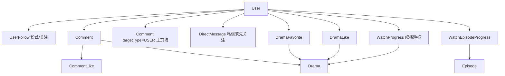

# 社交与片库目标数据模型

- 文档用途：约定关注、评论（剧评 + 用户主页墙）、私信、收藏、点赞和观看完成态的存储与接口，并对照当前 Prisma / Nest 实现
- 更新日期：2026-08-17
- Prisma 表与 Nest 处理器已落地；观看端「我的」收藏/点赞、消息摘要与播放页剧评已走 `getApi().social`（Mock 仍写内存片库）。消息分类仍不跳转；用户墙、剧场评论、私信会话页未接。实现进度见 [status.md](./status.md)
- 不变量仍遵守 [architecture.md](./architecture.md)：客户端状态不构成授权；计数可缓存但必须能从事实表重建；社交写路径需要用户 JWT
- 路径进入代码前必须先写入 `packages/contracts` 的 `API_ROUTES`，再实现服务端与客户端

## 1. 设计原则

- **不要把列表塞进 User 行**。粉丝、关注、评论、私信、收藏、点赞都是独立事实表。User 上最多放可重建的计数字段。
- **对象是剧（`Drama`）不是单集**，除非明确是进度。收藏/喜欢一部 20 集的剧，存 `dramaId`；续播再关联进度。
- **评论有两处入口，同一张 `Comment` 表**：剧评挂在剧下；用户主页墙挂在被评论的用户下。回复都指向父评论和被回复用户。
- **私信必须先关注**。发送方存在对接收方的 `UserFollow` 才能发新私信；取消关注后旧消息仍可读，不能再发。
- **私信与评论分开**。墙和剧评公开；私信仅会话双方可见。
- **看完是派生状态**。一部剧看完 = 当前已发布的每一集都从头看到片尾；任一集未看完则整部未看完。

## 2. 与当前实现的差距

| 能力 | 当前 |
| --- | --- |
| 用户资料 | `GET/PATCH /v1/me/profile`；公开主页 `GET /v1/users/:userId` 含可重建计数 |
| 观看进度 | `PUT /v1/me/progress` 同时 upsert 每集完成；`GET/DELETE /v1/me/history` 带 `completed` |
| 收藏 / 喜欢剧 | Nest `/v1/me/favorites`、`/v1/me/liked-dramas`；「我的」Tab 与播放页收藏/点赞走同一 `social` 客户端。Mock 读写 `history-state`，不是另一套列表 |
| 剧评 / 墙 / 评论赞 | Nest 已实现。播放页有 `dramaId` 时走剧评 API；剧场无真实剧 ID，评论仍本地。用户墙未接页面 |
| 关注 / 私信 | Nest 已实现。消息 Tab 登录后拉粉丝/评论收件/我的评论/获赞摘要，不跳转、不发私信。系统通知仍本地。私信写路径须先关注 |

Nest 处理器已落地；不得把 Mock 片库写成 Live 数据。Live 需先对本机 MySQL 执行 migrate。

## 3. 用户行：只放资料和可重建计数

`User` 现有资料字段保持不变，并增加可重建计数：

| 字段 | 含义 | 来源 |
| --- | --- | --- |
| `followerCount` | 粉丝数量 | `COUNT(UserFollow WHERE followeeId = 本用户)` |
| `followingCount` | 关注的人数 | `COUNT(UserFollow WHERE followerId = 本用户)` |
| `receivedCommentLikeCount` | 自己发出的评论被点赞总数 | `COUNT(CommentLike JOIN Comment WHERE authorUserId = 本用户)` |

这三项**不是**粉丝名单、关注名单或点赞名单。名单只存在关系表。缓存与事实表不一致时，以事实表重建为准。

不在 User 上存储：粉丝 ID 数组、关注 ID 数组、评论正文、私信正文、收藏剧 ID 列表。

## 4. 关注与粉丝

`UserFollow`

| 字段 | 含义 |
| --- | --- |
| `id` | 主键 |
| `followerId` | 关注者（粉丝） |
| `followeeId` | 被关注者 |
| `createdAt` | 关注时间 |

约束：`(followerId, followeeId)` 唯一；禁止自己关注自己；两端都必须是 `ACTIVE` 用户。

查询：

- 某用户的粉丝列表：`followeeId = 该用户`，按 `createdAt` 倒序分页
- 某用户关注的人：`followerId = 该用户`
- 粉丝数 / 关注数：对上表计数，或读 User 缓存

取消关注删除（或软删）对应行，并在同一事务内更新双方计数。取消关注后：**不能再向对方发私信**；已有会话仍可读取。

## 5. 评论：剧评 + 用户主页墙

同一张 `Comment` 表，用 `targetType` 区分入口，避免「剧评一套、墙一套」两套赞和回复。

| 字段 | 含义 |
| --- | --- |
| `id` | 主键 |
| `authorUserId` | 评论人 |
| `targetType` | `DRAMA`（剧评区）或 `USER`（用户主页墙） |
| `dramaId` | `DRAMA` 时必填；`USER` 时为空 |
| `targetUserId` | `USER` 时必填，即主页主人；`DRAMA` 时为空 |
| `episodeId` | 可选，仅剧评可挂集 |
| `parentCommentId` | 可选，回复的那条评论；回复不得跨 target |
| `replyToUserId` | 可选，被回复的用户；根评论可空 |
| `body` | 正文 |
| `likeCount` | 本条赞数缓存，可从 `CommentLike` 重建 |
| `status` | `VISIBLE` / `HIDDEN` / `DELETED` |
| `createdAt` / `updatedAt` | 时间 |

约束：

- `DRAMA`：必须有 `dramaId`，剧须 `PUBLISHED`
- `USER`：必须有 `targetUserId`，主人须 `ACTIVE`；允许对同一主人**多次**留言，不设唯一
- 回复继承父评论的 `targetType` / `dramaId` / `targetUserId`
- 不要求关注才能评墙或评剧；**只有私信要求先关注**
- 用限频防刷，不用唯一约束当成「只能评一次」

查询：

- 剧评流：`targetType=DRAMA AND dramaId=? AND parentCommentId IS NULL`
- 用户主页墙：`targetType=USER AND targetUserId=? AND parentCommentId IS NULL`
- 我发出的：`authorUserId = 我`（含剧评和墙）
- 别人对我的：`replyToUserId = 我`，或墙根评论 `targetUserId = 我`

软删保留行，正文对外不可见。

## 6. 评论点赞与「获得赞」

`CommentLike`

| 字段 | 含义 |
| --- | --- |
| `id` | 主键 |
| `userId` | 点赞人 |
| `commentId` | 被赞的评论（剧评或墙评均可） |
| `createdAt` | 时间 |

约束：`(userId, commentId)` 唯一。

「获得赞」= 自己作为 `authorUserId` 的可见评论上的 `CommentLike` 合计。与「喜欢一部剧」的 `DramaLike` 不是同一张表。

## 7. 私信（必须先关注）

发送新私信时服务端必须确认存在 `UserFollow(followerId=发送方, followeeId=接收方)`。互关则可双向发。未关注直接 403，不创建会话。取消关注后历史仍保留，发新消息仍 403。

`DirectConversation`：`userLowId` / `userHighId` 按 ID 排序唯一，带 `lastMessageAt`。

`DirectMessage`：`conversationId`、`senderId`、`body`、`createdAt`、`readAt`（空=未读）。允许同一粉丝多次发送。

## 8. 收藏的剧

`DramaFavorite`：`(userId, dramaId)` 唯一，`createdAt`。打开时读续播游标，不把进度写入收藏行。

## 9. 点赞（喜欢）的剧

`DramaLike`：`(userId, dramaId)` 唯一。与收藏独立。打开时同样只读 `WatchProgress` 游标。

## 10. 观看历史、续播与看完

续播游标继续用现有 `WatchProgress`（每用户每剧一行：当前集 + 秒数）。

另增 `WatchEpisodeProgress`：`(userId, episodeId)` 唯一，含 `completedAt`。一集看完 = 有效位置达到片尾容差（容差必须是契约常量）。

整剧看完 = 该剧当前已发布的每一集都有 `completedAt`。新集上架后整剧回到未看完。

`GET /v1/me/history` 目标响应增加 `completed`（及可选每集摘要），不另建已看完表。删除历史同时删游标和该剧每集进度，不删收藏/喜欢/评论。

`PUT /v1/me/progress` 目标：仍更新游标，并 upsert 对应集的 `WatchEpisodeProgress`。

## 11. 关系总览

## 12. 认证、分页与注销

- 公开读：已发布剧的剧评、用户主页资料与墙（注销用户除外）。匿名 viewer 只读，不可写。
- 写关注、评论、赞、私信、收藏、喜欢：用户 JWT。
- 私信写路径额外检查关注关系。
- 列表一律服务端分页。
- 注销后：公开墙与剧评按保留矩阵匿名或隐藏；私信、关注、收藏、喜欢、进度按矩阵删除或匿名。

## 13. 页面谁用哪些接口

「已有」指当前契约已存在；「目标」指本文规划、尚未进 `API_ROUTES`。

| 页面 / 交互 | 已有接口 | 目标接口 | 用途 |
| --- | --- | --- | --- |
| 「我的」资料卡 | `GET/PATCH /v1/me/profile`、`POST /v1/auth/wechat` | `GET /v1/me/profile` 扩展粉丝/关注/获赞计数 | 展示数量；点数字进列表 |
| 他人主页墙 | 无此页 | `GET /v1/users/:userId`；墙 `GET/POST /v1/users/:userId/wall`；`POST/DELETE .../follow` | 看资料、留言、关注 |
| 剧详情 / 播放器 / 剧场评论底栏 | `GET /v1/dramas/:id` | `GET/POST /v1/dramas/:dramaId/comments`；回复与赞见评论写接口 | 剧评区；点头像进他人主页 |
| 「我的」历史 Tab | `GET/DELETE /v1/me/history`；`PUT /v1/me/progress`（播放器写） | 历史项带 `completed`；进度写入带动每集完成态 | 续播；已看完/未看完筛选 |
| 「我的」收藏 Tab | 无 | `GET/PUT/DELETE /v1/me/favorites` | 列表；打开走历史游标续播 |
| 「我的」点赞 Tab（喜欢的剧） | 无 | `GET/PUT/DELETE /v1/me/liked-dramas` | 同上续播 |
| 播放器收藏/喜欢按钮 | 无 | 同上 PUT/DELETE | 与 Tab 共用 |
| 「我的」消息：粉丝 | 无 | `GET /v1/me/followers` | 粉丝列表 |
| 「我的」消息：评论 / 我的评论 | 无 | `GET /v1/me/comment-inbox`、`GET /v1/me/comments` | 墙+剧评回复与我发出的 |
| 「我的」消息：赞 | 无 | `GET /v1/me/received-comment-likes` | 谁赞了我的评论 |
| 「我的」消息：私信 | 无 | 会话与消息接口 | 仅已关注关系可发 |
| 评论上点赞 | 无 | `PUT/DELETE /v1/comments/:id/likes` | 剧评和墙评同一套 |

系统通知仍可本地或运营配置，不并进私信表。

## 14. 目标 HTTP 路径

命名对齐现有 `/v1/me/*` 与 `/v1/dramas/:id`，并已落入 `packages/contracts` 的 `API_ROUTES`。Nest 处理器已实现；观看端「我的」收藏/点赞与消息摘要已改接，私信会话页未做。

### 14.1 公开用户与关注

| 方法 | 路径 | 认证 | 作用 |
| --- | --- | --- | --- |
| GET | `/v1/users/:userId` | 可选 JWT | 公开资料：昵称、头像、签名、性别、粉丝/关注/获赞计数；登录时附 `followedByMe` |
| POST | `/v1/users/:userId/follow` | 用户 JWT | 关注；幂等 |
| DELETE | `/v1/users/:userId/follow` | 用户 JWT | 取关；幂等 |
| GET | `/v1/users/:userId/followers` | 可选 JWT | 粉丝分页 |
| GET | `/v1/users/:userId/following` | 可选 JWT | 关注分页 |
| GET | `/v1/me/followers` | 用户 JWT | 我的粉丝 |
| GET | `/v1/me/following` | 用户 JWT | 我的关注 |

### 14.2 剧评与用户墙

| 方法 | 路径 | 认证 | 作用 |
| --- | --- | --- | --- |
| GET | `/v1/dramas/:dramaId/comments` | 可选 JWT | 剧评根列表；登录时附 `likedByMe` |
| POST | `/v1/dramas/:dramaId/comments` | 用户 JWT | 发剧评；body 可含 `parentCommentId` 作为回复 |
| GET | `/v1/users/:userId/wall` | 可选 JWT | 主页墙根列表 |
| POST | `/v1/users/:userId/wall` | 用户 JWT | 在对方主页留言或回复墙上评论 |
| GET | `/v1/comments/:commentId/replies` | 可选 JWT | 某条评论的回复分页 |
| DELETE | `/v1/comments/:commentId` | 用户 JWT | 作者软删自己的评论 |
| PUT | `/v1/comments/:commentId/likes` | 用户 JWT | 赞；幂等 |
| DELETE | `/v1/comments/:commentId/likes` | 用户 JWT | 取消赞 |
| GET | `/v1/me/comments` | 用户 JWT | 我发出的剧评和墙评 |
| GET | `/v1/me/comment-inbox` | 用户 JWT | 回复我的、留在我墙上的 |
| GET | `/v1/me/received-comment-likes` | 用户 JWT | 我的评论被赞 |

### 14.3 私信（写路径校验关注）

| 方法 | 路径 | 认证 | 作用 |
| --- | --- | --- | --- |
| GET | `/v1/me/conversations` | 用户 JWT | 会话列表 |
| POST | `/v1/me/conversations` | 用户 JWT | 对 `peerUserId` 取或建会话；**未关注则 403** |
| GET | `/v1/me/conversations/:conversationId/messages` | 用户 JWT | 消息分页；须为会话成员 |
| POST | `/v1/me/conversations/:conversationId/messages` | 用户 JWT | 发信；**仍须当前关注对方** |
| POST | `/v1/me/conversations/:conversationId/read` | 用户 JWT | 标记已读 |

### 14.4 收藏与喜欢剧

| 方法 | 路径 | 认证 | 作用 |
| --- | --- | --- | --- |
| GET | `/v1/me/favorites` | 用户 JWT | 收藏列表；项内可带续播游标 |
| PUT | `/v1/me/favorites/:dramaId` | 用户 JWT | 收藏；幂等 |
| DELETE | `/v1/me/favorites/:dramaId` | 用户 JWT | 取消收藏 |
| GET | `/v1/me/liked-dramas` | 用户 JWT | 喜欢的剧 |
| PUT | `/v1/me/liked-dramas/:dramaId` | 用户 JWT | 喜欢；幂等 |
| DELETE | `/v1/me/liked-dramas/:dramaId` | 用户 JWT | 取消喜欢 |

### 14.5 已有进度接口的语义扩展（不新开路径）

| 方法 | 路径 | 规划变化 |
| --- | --- | --- |
| PUT | `/v1/me/progress` | 除游标外 upsert 每集进度/完成 |
| GET | `/v1/me/history` | 每项增加 `completed`；打开历史/收藏/喜欢都靠游标续播 |
| DELETE | `/v1/me/history` | 同时删该剧每集进度 |

## 15. 落地顺序

1. 公开主页 `GET /v1/users/:userId` + 关注四件套
2. `WatchEpisodeProgress` 与历史 `completed`
3. 收藏 / 喜欢剧
4. 剧评 + 墙 + 评论赞
5. 私信（依赖关注关系）

服务端上述步骤已实现。观看端收藏/点赞、消息摘要与播放页剧评已改接 `getApi().social`；私信会话页、关注列表页和用户墙仍未做。

## 16. 明确不在本规划里的东西

- 不把粉丝数、获赞数当成不可重建的业务真相。
- 不把弹幕、评分、推荐个性化并进这些表。
- 不在未改契约和 Prisma 前实现写接口，或把 Mock 收藏当成 Live 数据。
- 当前内部验证主路径仍是播放与权益；社交写路径仅 Mock 内部体验，不得当作对外上线。
